<!-- ABOUTME: Design research for a vendor-agnostic, supervised-autonomy software-engineering agent fleet. -->
<!-- ABOUTME: Covers the capability landscape, every architecture style with pros/cons, economics, and a phased recommendation. -->

# The Living Engineering Team: A Vendor-Agnostic Autonomous Agent Fleet

> **Document status:** Draft 4 (research-grounded; survived two full adversarial critique-improve rounds — converged)
> **Author:** Claude (with Doctor Biz)
> **Product stages** referenced throughout are **V0 → V3** (build milestones). "Draft N" = this document's revision; "V0–V3" = the thing you build. They are different axes.
> **Goal (aspiration):** A human *client* submits work in natural language; a self-organizing fleet of AI agents plans, implements, tests, reviews, documents, and ships it — vendor-agnostic (Claude, Codex, local), as autonomous as verification can safely support.

---

## TL;DR (if you read nothing else)

1. **Build first (V0, days–2 wks):** one headless worker → branch → tests → PR, gated by **one independent critic + one independent tester** (maker≠checker) + a hard CI gate + a 3-try cap. Prove it on your throwaway repo.
2. **Architecture:** **Orchestrator–Worker** as the default spine, with a **supervisor-tree** reliability overlay and an **ensemble/debate** verification overlay; event-driven choreography when you scale; hierarchical only for big multi-subsystem jobs. Everything else is rejected as *primary* (reasons inside).
3. **Vendor-agnostic** = models behind **LiteLLM** (real config swap) + tools behind **MCP** + workers behind a **common adapter interface** (real work, not config).
4. **The honest caveat:** this is *supervised autonomy on a dial*, not lights-out. Run the fleet only when work is **parallel + well-specified + high-value** — otherwise one engineer + one interactive agent is cheaper. The dial opens as your own eval proves the critics catch bugs.

---

## 0. Honest framing — what this is, and is not

The request was a "fully autonomous" fleet. The honest position, after hard review:

> **Today's realistic target is *supervised autonomy within bounded phases*, with a configurable "autonomy dial" (§3) that opens as verification earns trust — not lights-out full autonomy.**

**The central tension, stated plainly (don't let it hide):** a fleet job costs **~30–100× a single agent call** but buys only **~3× parallel throughput**. At the gated dial position (L1) you *also* still pay human review time — so at L1 the fleet is, honestly, *more expensive assisted coding*. The economics only turn positive when **either** the work is high-value and genuinely parallel (you're buying wall-clock, not cost savings) **or** the dial opens past L2 (removing human cost) — and the dial only opens once your eval shows verification is trustworthy. **Those two unlocks are the whole game; §13 gives the arithmetic and the bootstrap path.** Verification's limits are detailed once, in §10.

The philosophy: **decisive about architecture, honest about limits, staged so you prove value cheaply (V0) before spending on the ambitious version.** Where autonomy is safe the dial opens; where it isn't, a gate stays shut.

---

## 1. How to read this

**§2** why this isn't a swarm · **§3** the autonomy dial · **§4** capability landscape (Claude/Codex/OSS/abstraction) · **§5** building blocks · **§6** role model · **§7** every architecture style (facet-complete) + rejected ones · **§8** dynamic planning · **§9** safe parallelism · **§10** verification & the critique-improve loop · **§11** security threat model · **§12** client interaction & the dial in practice · **§13** economics & GO/NO-GO · **§14** iterations V0→V3 · **§15** final recommendation · **§16** risks · **§17** testing/observing/operating · **§18** appendix: schemas & build order · **§19** sources.

---

## 2. The disciplining truth (why this is not a swarm)

> **Software engineering is a poor fit for naive breadth-first multi-agent parallelism.** Anthropic's multi-agent team reports coding "involves fewer truly parallelizable tasks than research, and LLM agents are not yet great at coordinating and delegating in real time," and that multi-agent systems use **~15× the tokens of a chat interaction**. A recent (2026, single-preprint, *directional*) study reports **~20% textual conflict between parallel agents** on shared code.

The winning shape:

> A **thin, deterministic control plane** orchestrating a **small number of strongly-isolated, single-threaded workers**, coordinated by the **dependency structure of the work** and **git isolation**, with **adversarial verification + human gates** as the trust backbone.

Autonomy inside bounded phases; determinism in the harness. Reserve the fleet for high-value, parallelizable, well-specified work.

---

## 3. The autonomy dial — "fully autonomous" as a spectrum

"Fully autonomous" is a **per-risk-tier policy**, not one setting:

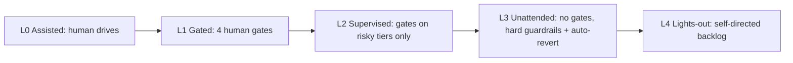

| Dial | Human gates | When | Extra guardrails required |
|---|---|---|---|
| **L0 Assisted** | human drives; agent suggests | interactive dev | none (not a fleet) |
| **L1 Gated** | spec + design + pre-release + final-merge | new codebase, low trust, high stakes | baseline |
| **L2 Supervised** | spec + final-merge for low-risk tiers only | proven fleet, understood repo | risk classifier (§18); auto-approve low-risk |
| **L3 Unattended** | none; async escalation only | sandboxed/throwaway repos, bulk mechanical | kernel sandbox, egress denylist, **auto-revert**, per-job budget hard-stop, safe-state-on-timeout |
| **L4 Lights-out** | none; picks own backlog | aspirational | all of L3 + eval proving critic catch-rate over the §18 thresholds |

**"L3-lite" (for V0 on a throwaway repo):** you do *not* need the full L3 guardrail set to run unattended on a disposable repo. The **cheap, mandatory-even-for-V0** guardrails are **auto-revert on post-merge failure + per-job budget hard-stop + safe-state-on-timeout**; the **expensive, deferrable** ones (kernel sandbox, network egress denylist) can wait for V2 when you point the fleet at a *real* repo with real secrets. So: **V0 runs L1-gated for correctness proof, and separately exercises "L3-lite" on the throwaway repo to prove unattended safety** — the two are different experiments, not one "L3 in days" claim.

**The 3am / no-human problem:** if an escalation fires and no human answers within the gate SLA, the job reaches a **safe state** — park the branch (never merge), snapshot for resume, notify, free the worker's claim. Never block a worker forever; never auto-merge past an unanswered gate.

---

## 4. Capability landscape

### 4.1 Claude side (Anthropic) — the most batteries-included worker
- **Claude Agent SDK** (Python `claude-agent-sdk` / TS `@anthropic-ai/claude-agent-sdk`) — the Claude Code loop as a library on *your* infra: built-in tools (`Read/Write/Edit/Bash/Glob/Grep/WebSearch`), subagents, sessions, permissions, hooks, MCP.

  ```python
  from claude_agent_sdk import query, ClaudeAgentOptions, ResultMessage

  async for msg in query(
      prompt="Find and fix the bug in auth.py",
      options=ClaudeAgentOptions(
          allowed_tools=["Read", "Edit", "Bash"],
          max_turns=30,
          max_budget_usd=5.0,          # hard cost cap
          permission_mode="acceptEdits",
      ),
  ):
      if isinstance(msg, ResultMessage) and msg.subtype == "success":
          print(msg.result)
  ```

- **Permission modes** *(per docs — confirm against your SDK version)*: `default` (prompt via `canUseTool`), `plan` (explore, never auto-write), `acceptEdits`, `dontAsk` (only pre-approved tools — **locked-down CI**), `bypassPermissions` (auto-approve all — *isolated containers only*). Scoped rules: `Bash(git diff *)` + `disallowed_tools=["Bash(rm *)"]`.
- **Hooks**: `PreToolUse`, `PostToolUse`, `PostToolUseFailure`, `SubagentStart/Stop`, `PreCompact`, `Stop`, `SessionStart`, `Notification`. `PreToolUse` can **deny** before anything runs — the enforcement point for §11.
- **Subagents** — isolated context, restricted tools, per-agent model/effort, `background=True`. **Subagents generally cannot spawn subagents — nesting is one level.** Hierarchical topologies (§7.2) are therefore built at *your* orchestration layer, not via native recursion.
- **Headless** — `claude -p "<task>" --output-format json|stream-json`, `--json-schema`, `--resume <id>`, `--bare`. Quickest "edit repo → PR" path.
- **Sessions** — resumable across processes (`resume=id`), `fork_session=True` to branch. JSONL-backed; pluggable store for serverless.
- **Anthropic API** — **Tool Runner** (client-side loop over your tools) and **Managed Agents** (Anthropic-hosted, REST+SSE, server-side state, cloud/self-hosted sandbox, coordinator→worker orchestration).
- **Cost reality:** a full agentic review+fix+test cycle on a mid-tier model is **order $0.50–several dollars**, not cents.

### 4.2 Codex / OpenAI side — a peer worker
- **Codex CLI** (`@openai/codex`, Rust): `codex` / `codex exec`. Approval read-only → auto-edit → full-auto; **kernel-level sandbox**.
- **Codex Cloud** — hosted async SWE agent (preview May 16 2025; `codex-1`, later **GPT-5-Codex** Sept 2025). Dispatch → container → diff/PR. Natural **unattended worker**.
- **Codex SDK** (TS) — same agent embeddable (threads, tools, approval policy, MCP).
- **OpenAI Agents SDK** (MIT) — Agents / Tools / **Handoffs** / **Guardrails** / Sessions / Tracing; drives non-OpenAI models **via LiteLLM**. In-process runner, **not** durable.

### 4.3 Open-source frameworks
| Framework | Model | Agnostic | License | Fit |
|---|---|---|---|---|
| **LangGraph** | Graph + state + checkpointing | Yes | MIT | Per-task graph engine (durability overlap → §4.5). |
| **CrewAI** | Role crews | Yes | MIT | Fast role prototyping. |
| **AutoGen / AG2** | Conversational GroupChat | Yes | MIT | Dynamic agent conversation. |
| **OpenHands** | Full autonomous SWE agent (CodeAct) | Yes | MIT | ~70%+ SWE-bench Verified (model/scaffold-dependent). Ready **worker**. |
| **SWE-agent** | Agent + ACI | Yes | MIT | mini-SWE-agent ~65% in ~100 LOC — minimal worker. |
| **Aider** | Architect/editor, git-native | Yes | Apache-2.0 | Superb model-agnostic **committing worker**. |
| **Temporal** | Durable workflow engine | Agnostic | MIT / Cloud commercial | **Reliability substrate** for days-long, gated, replayable jobs. |

### 4.4 The vendor-agnostic abstraction layer — split the claim honestly
- **Model-agnostic (real, cheap):** **LiteLLM** (MIT) — one OpenAI-format API to 100+ providers; proxy adds fallbacks, cost/latency routing, virtual keys, budgets, RBAC. Swapping the *raw model* **is** config.
- **Runtime-agnostic (real work, NOT config):** worker *harnesses* (Agent SDK vs Codex vs OpenHands) differ in tool schemas, permissions, hooks, sandbox, sessions. Swapping a worker is a **bespoke adapter**. **→ Define a common `Worker` interface (§18) as an explicit V1 deliverable.**
- **Tools:** **MCP** — write once, all runtimes use it; `@tool` + `create_sdk_mcp_server` for in-process.
- **Interop (later):** **A2A** (Linux Foundation, Jun 2025) — complementary to MCP (tool↔agent) for agent↔agent; governance still immature.

Core stack is **MIT/Apache-2.0** — no license blocker.

### 4.5 Durability: pick ONE engine
Temporal and LangGraph are **both** persistence+replay engines; Temporal's replay needs *deterministic* workflow code (LLM calls isolated in **activities**). **Do not stack both.**

| Choose | When | Pattern |
|---|---|---|
| **Temporal alone** (V2+) | days-long, human-waits, retries, replay/audit | each task-agent = an activity; workflow is deterministic glue |
| **LangGraph alone** (fine for V1) | graph mental model, HITL, checkpoints, no long-horizon needs yet | LangGraph checkpointer is your state; add Temporal only if you outgrow it |

### 4.6 Reality check
- **SWE-bench Verified**: strong model + good harness **~70%+**; mini-SWE-agent ~65%. **85–95% blog figures are AI-generated SEO — excluded.**
- **~20% of "solves" are semantically wrong** (coincidental/reward-hacked), per rigorous re-eval — *directional*.
- **Poor uncertainty signaling** — wrong answers sound as confident as right ones. The core danger for unattended fleets.
- **Context drift** on long runs → subtly-wrong output.
- Track **your own held-out eval**; public SWE-bench is contaminated/inflated.

---

## 5. Building blocks
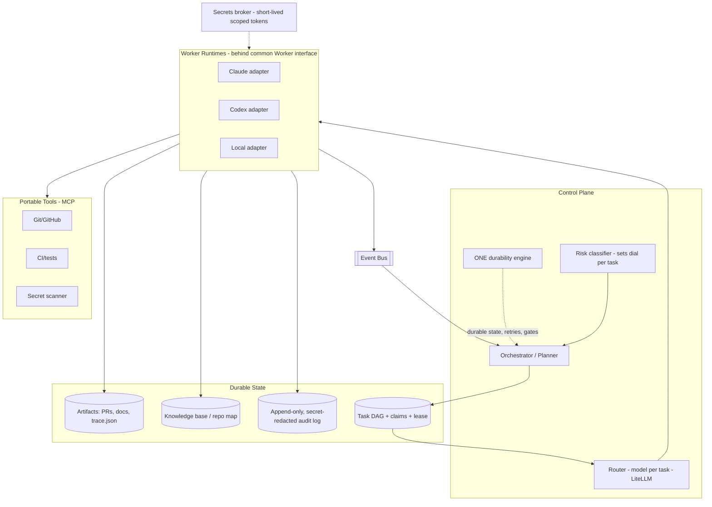
Control plane (router = vendor-agnosticism + a **risk classifier** setting the dial per task) · **one** durability engine (resume, don't restart) · task DAG + **atomic claims + lease TTL/reclamation** · knowledge base (plain retrieval, not "learning") · artifact store (`trace.json`) · event bus · governance (**hash-chained, secret-redacted audit log**) · **secrets broker + scan-before-persist** · workers behind a common interface · MCP tools.

---

## 6. Role model
| Role | Responsibility | Gate? | Tier |
|---|---|---|---|
| Intake / PM | request → spec + acceptance criteria | **spec** | strong |
| Architect / Planner | decompose → DAG; ADRs; flag non-parallelizable | **design** | strong |
| Implementer | one scoped task, own worktree/branch | — | mid/strong |
| Tester | tests **from the contract, blind to the implementation** | — | mid |
| Reviewer / Critic | adversarial review **against the contract**; try to *refute* | — | strong |
| Docs writer | docs, changelog, PR body | — | cheap |
| Integrator / Release | merge queue, conflict ladder, CI gate, PR | **pre-release + final-merge** | mid+tools |
| Coordinator | assign, track, own escalation & safe-state | — | strong |

**Maker never grades the checker:** Implementer ≠ Reviewer ≠ Tester — distinct agents, no shared history.

---

## 7. Architecture styles
Every viable style: **how it works / diagram / pros / cons / when / cost-complexity / failure-modes.**

### 7.1 Style A — Orchestrator–Worker (default; = hub-and-spoke)
**How:** one orchestrator decomposes → parallel workers → verify → integrate.
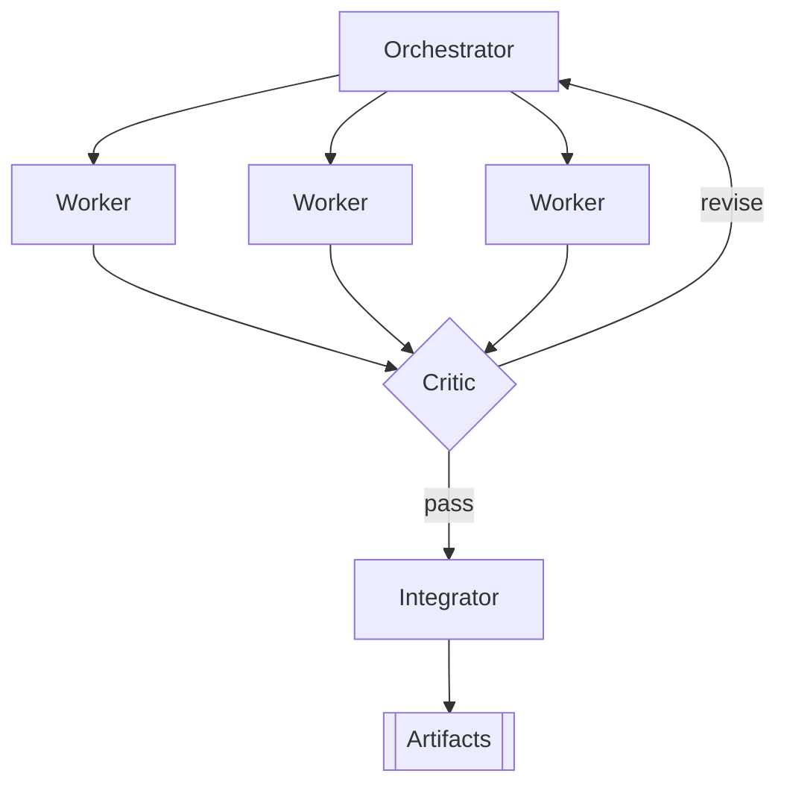
- **Pros:** simple, debuggable, parallel, bounded cost, clear verification point.
- **Cons:** orchestrator bottleneck + single point of failure; needs clean up-front decomposition.
- **When:** most separable requests. **Best default; two-tier.**
- **Cost:** low–medium. **Failure:** bad decomposition cascades; vague briefs → duplicate/conflicting work; orchestrator context bloat.

### 7.2 Style B — Hierarchical (manager → leads → workers)
**How:** recursion of A; built at the orchestration layer (subagents don't recurse).
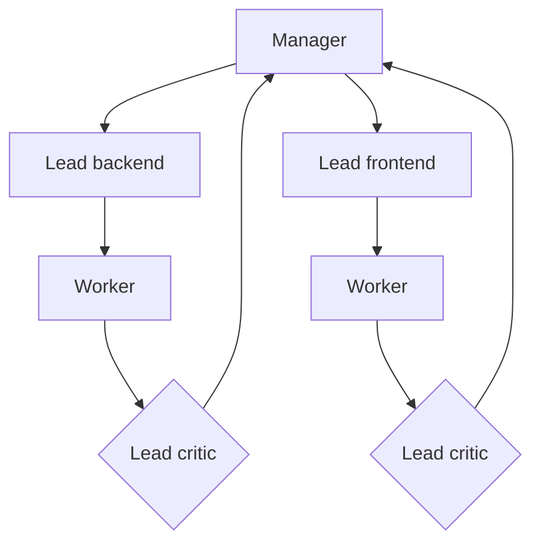
- **Pros:** scales to separable subsystems; local context per branch.
- **Cons:** coordination + latency tax per tier; error compounding; higher token cost.
- **When:** large multi-subsystem features. Overkill otherwise. **Cost:** med–high. **Failure:** telephone-game drift; lead replan loops; cost blowups if unbounded.

### 7.3 Style C — Blackboard / shared-memory
**How:** agents read/write a shared workspace; a controller picks the next contribution.
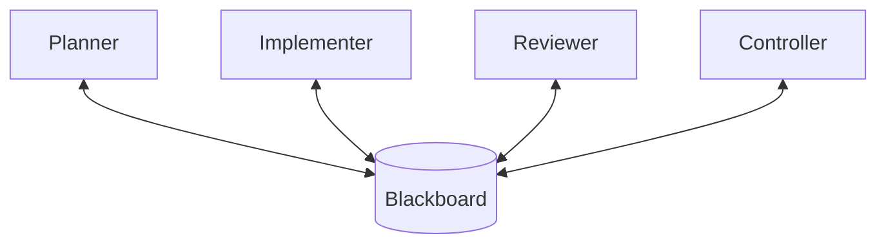
- **Pros:** emergent, loosely coupled, resilient; natural knowledge base.
- **Cons:** hard to control; thrashing/livelock; poor observability.
- **When:** exploration/debugging. **Use for *facts*, never as the who-edits-what coordinator.** **Cost:** medium. **Failure:** contention; overwrites; non-convergence.

### 7.4 Style D — Market / bidding (contract-net)
**How:** tasks auctioned; agents bid (confidence/cost/ETA); best wins.
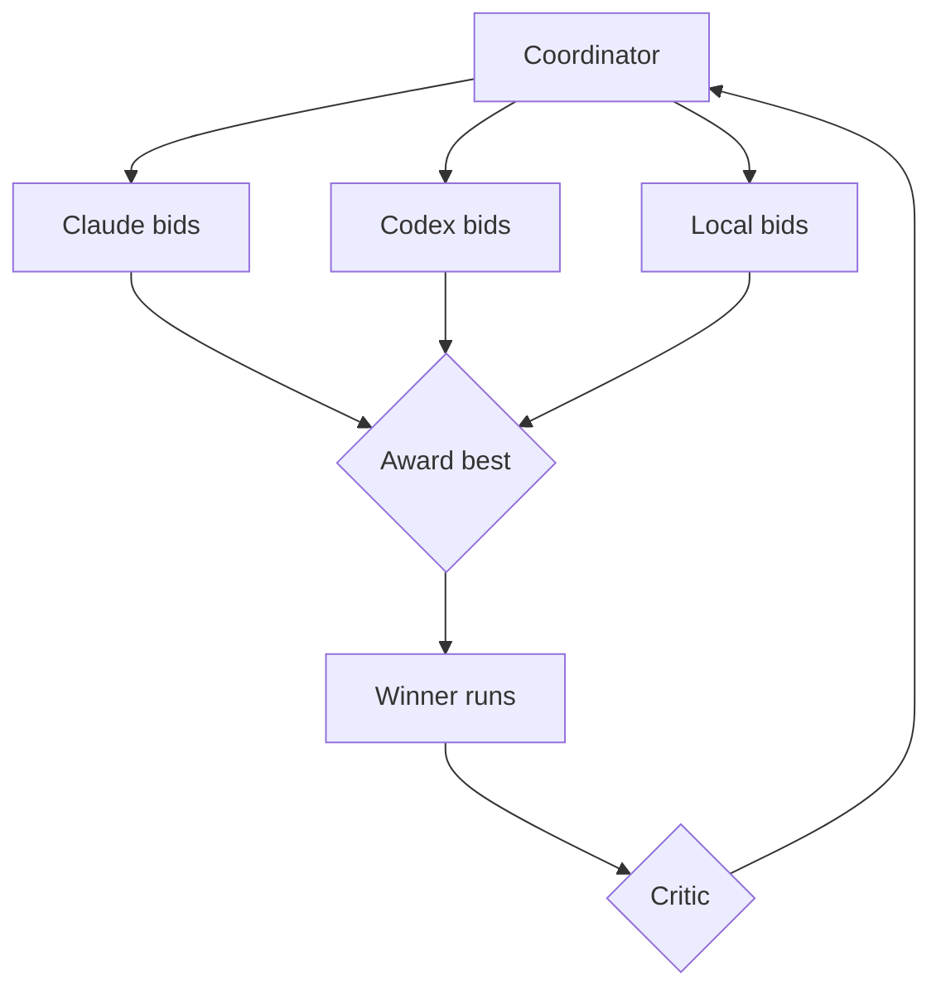
- **Pros:** self-optimizing cost/capability routing; decentralized balancing.
- **Cons:** auction latency/token overhead; agents misjudge confidence; needs trustworthy scoring.
- **When:** heterogeneous, cost-first fleets. **Scaling escape hatch, not V1.** **Cost:** med–high. **Failure:** overconfident bids win bad work; overhead on small tasks; gaming.

### 7.5 Style E — Peer-to-peer / swarm (handoff)
**How:** no boss; agents hand off directly (Agents-SDK handoffs, AutoGen chat).
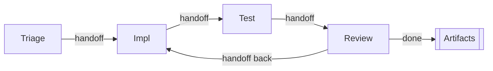
- **Pros:** no central bottleneck; flexible; low ceremony.
- **Cons:** hard to guarantee termination; diffuse state; loops; hardest to audit/bound.
- **When:** small open-ended teams / prototyping. **Premature for autonomous SWE.** **Cost:** low to build, high to control. **Failure:** infinite handoffs; no owner of "done"; runaways.

### 7.6 Style F — Event-driven / choreography
**How:** agents react to bus events and emit new ones (choreography vs orchestration).
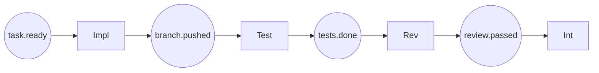
- **Pros:** highly decoupled, scalable, resilient; easy to add reactive agents; async + audit-friendly.
- **Cons:** emergent global behavior hard to reason about; no single place knows the whole plan; distributed-causality debugging.
- **When:** large fleets, high concurrency; pairs with A (orchestrated decomposition, choreographed execution). **Cost:** med–high (real bus + idempotent handlers). **Failure:** event storms/cycles; lost/duplicated events without exactly-once; hidden coupling via contracts.

### 7.7 Style G — Supervisor trees (reliability overlay)
**How:** agents run under **supervisors** owning restart strategies (restart-one / restart-siblings / escalate).
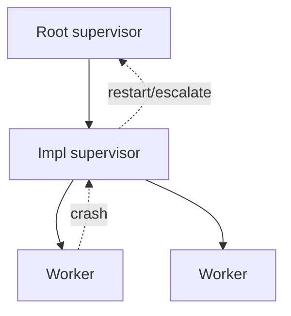
- **Pros:** principled crash recovery; bounds blast radius of a stuck/looping agent; composes with any style.
- **Cons:** a reliability overlay, not a work-decomposition model; restart semantics for stateful agents are subtle.
- **When:** **always, as an overlay** for L3+ (this is how §5's claim-lease/reclamation gets concrete). **Cost:** medium. **Failure:** restart loops (always-crashing task); lost in-flight work if not checkpointed.

### 7.8 Style H — Ensemble / debate (verification overlay)
**How:** multiple agents solve/judge the *same* task, reconcile by vote or structured debate.
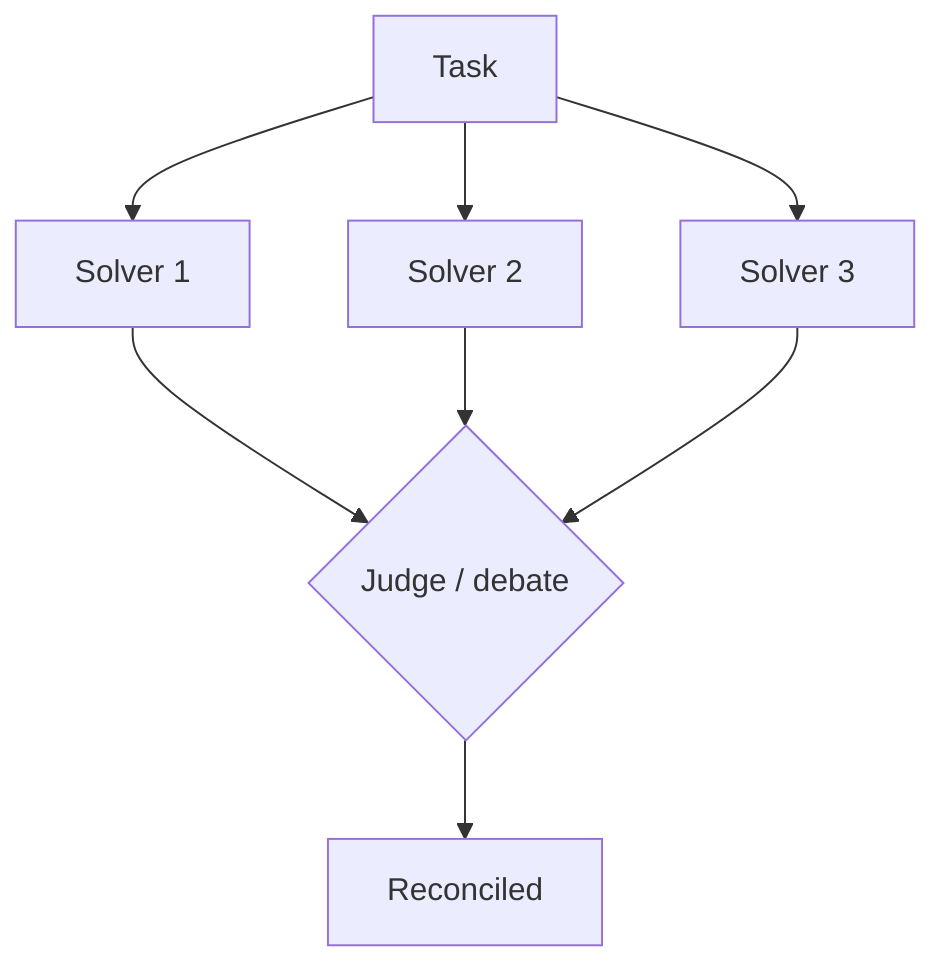
- **Pros:** raises quality on hard/high-stakes tasks; debate surfaces hidden disagreement.
- **Cons:** N× cost; **correlated same-family errors cap the gain** (§10); slower.
- **When:** the **verification layer for high-risk changes only**, and design choices (2–3 candidate architectures). Not for routine implementation. **Cost:** high. **Failure:** false confidence from correlated agreement; judge inherits blind spots; cost explosion.

### 7.9 Considered and rejected
- **Actor model:** a fine *implementation substrate* under any style; too low-level to be the team design.
- **Human-as-agent:** already present as the escalation/gate mechanism (§12); modeled as a special worker the coordinator can assign to, not a distinct topology.
- **Pure hub-and-spoke:** identical to Style A (named so it's not thought omitted).

### 7.10 Cross-cutting: fixed pipeline vs dynamic planning
**How:** a **fixed *lifecycle* wrapping dynamic *plans*.**
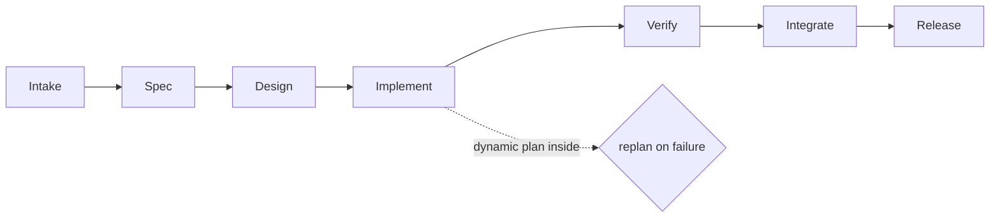
- **Pros:** fixed = deterministic/cheap/auditable; dynamic = adapts to discoveries.
- **Cons:** fixed = brittle when reality deviates; dynamic = costlier, harder to bound.
- **When:** fixed for routine, dynamic for novel; **hybrid recommended.** **Cost:** hybrid = medium. **Failure:** dynamic → over-decompose/replan thrash; fixed → silent brittleness.

### 7.11 At a glance & composition
| Style | Control | Parallelism | Flex | Cost | Debug | Best for |
|---|---|---|---|---|---|---|
| A | Central | High | Med | Low | High | **Default** |
| B | Layered | High | Med | High | Med | Multi-subsystem |
| C | Shared | Med | High | Med | Low | Exploration (facts) |
| D | Auction | High | High | Med-High | Med | Cost routing at scale |
| E | None | Med | High | Var | Low | Small open-ended |
| F | Choreographed | High | High | Med-High | Med | Large async fleets |
| G | Recovery overlay | — | — | Med | Med | **Reliability** |
| H | Judge overlay | — | — | High | Med | **Verification** |

**Composition:** **A (default) + G (reliability) + H (verification, high-risk only) + F (choreography at scale) + B (big multi-subsystem only).**

---

## 8. Dynamic workflow generation
- **Plan-and-Execute at the top (with replanning)** — planner emits the DAG; executors run tasks; assess failures against the whole plan.
- **ReAct inside each worker — budgeted** (step/cost cap + loop-breaker; its failure mode is looping on a failed action).
- **Reflection must be cross-agent** (self-critique repeats the model's own blind spots).
- **Tree-of-Thoughts** — only for branchy *design* decisions.
- **Decompose → DAG → queue** — each task carries acceptance criteria, file scope, `depends_on`, and a **`parallelizable` flag** (§9). **Parallelism ≤ the DAG's independent frontier.** Atomic claims via `SKIP LOCKED` + lease TTL.
- **Replan honestly:** static replan (re-run planner on the remainder) ships now; **online mid-execution replanning is immature — a research spike (§14), not a dated deliverable.**

---

## 9. Safe parallelism — textual *and* semantic
- **Branch-per-task + git worktrees** — `git worktree add ../wt-task-123 -b task/123` → filesystem isolation, no silent overwrites/lock contention.
- **Task-granular scoping** — non-overlapping file sets where possible; overlaps become dependency edges.
- **The non-parallelizable class (serialize, single-writer):** schema/migrations, shared interfaces/type signatures, dependency/lockfile bumps, generated code. These **rebase clean but break semantically** across non-overlapping files; CI catches them only if a test covers the interaction. **Planner flags these and runs them single-writer.**
- **Serialized FIFO merge queue** — workers never merge to main; an **integrator** rebases + runs full CI per branch, one at a time.
- **Re-review after rebase** — rebasing changes what the critic approved; **re-run the critic post-rebase** (budget it).
- **Conflict ladder:** auto-rebase clean → auto-resolve mechanical → bounce to implementer with context → escalate.
- **Residual risk (honest):** the queue guarantees **textual + test-covered** correctness only; untested semantic interactions are caught by the pre-release gate (L1/L2) or **post-merge auto-revert** (L3).
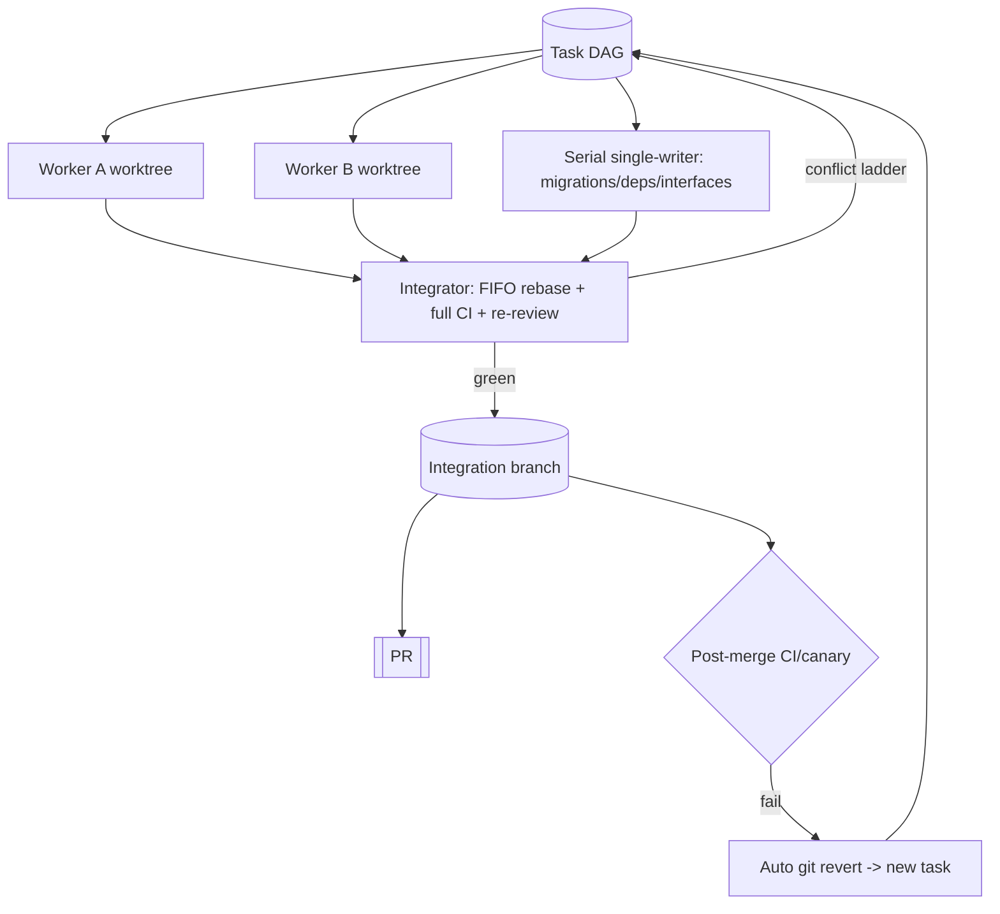

---

## 10. Verification & the critique-improve loop (the trust backbone)

The threat is **plausible-but-wrong work** — a model that just wrote code "hallucinates correctness." Defeating it is an **architecture** problem. This is where the **critique-improve loop** is a first-class citizen — both the fleet's internal mechanism *and* the process this very document went through.

**The loop:**
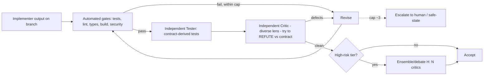

**Principles (stated authoritatively here; referenced elsewhere):**
1. **Automated gates first** — tests, lint, types, build, security scan. Cheap, objective, fail-closed. *Test output must be pristine.*
2. **Structural independence** — Builder / Critic / Tester are separate agents, separate payloads, **no shared history**. The verifier sees **the contract, not the implementation's reasoning**. The tester writes tests **blind to the implementation**.
3. **Cost-tiered critique (the key economic lever):** the **default is ONE strong diverse-lens critic** + the hard test gate + the human backstop. Reserve **3-critic voting / debate (Style H) for high-risk tiers only** — because voting is the biggest cost driver (§13) and its benefit is *capped by correlated errors* (next point).
4. **Voting's honest ceiling:** critics from the same model family have **correlated** errors, so majority voting helps far less than independence implies; "diverse lenses" (correctness/security/does-it-run/matches-spec) and, where budget allows, **different model families** reduce but don't eliminate this. **Realistic false-negative rate on subtle/semantic bugs is 20–40%, not ~0.** This is *the* reason humans stay on the critical path at gates.
5. **Machine-checkable Definition of Done** — `trace.json` (§18) links **requirement → file → test**; the spec is **content-hashed at approval**; a **drift check** flags files changed outside a registered acceptance-criterion scope. *Detect, not prevent* — the human gate is the final backstop.
6. **Hard iteration cap (~3) then escalate** — LLM debugging effectiveness decays within 2–3 attempts; the cap defends against both confident-wrong output and runaway loops.
7. **Loop-until-dry** — keep critiquing until N consecutive rounds surface nothing material, then stop. (Exactly the process applied to this document: two rounds until findings were only polish.)

Without this loop, autonomy is just fast wrongness. Verification, not generation, is the scaling bottleneck.

---

## 11. Security threat model
A fully-autonomous fleet **ingests attacker-controllable text** (malicious issue, poisoned dependency README, crafted comment) then **runs Bash**. Prompt injection is the #1 real-world risk.
- **Treat all repo/issue/PR/dependency content as untrusted.**
- **Separate "read untrusted input" from "high-privilege action"** — the agent reading an issue holds no secrets or merge rights.
- **Kernel sandbox + network egress denylist** for workers; no arbitrary outbound network after reading untrusted text.
- **PreToolUse hooks enforce** — deny edits to secrets/CI config, deny exfil-shaped commands, deny writes outside task scope.
- **Secrets broker** — short-lived scoped tokens; **scan every diff and log line for secrets before persistence**; redact in the audit log.
- **Data/IP governance** — classify repos: which may use hosted models vs must stay on **local/self-hosted**; enforce at the LiteLLM proxy.
- **Supply-chain** — dependency additions go through the non-parallelizable single-writer path + security scan.

---

## 12. Client interaction & the dial in practice
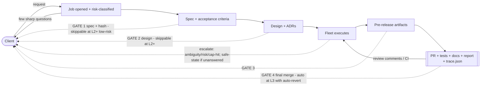
Four gates at L1; fewer as the dial opens. Clarify before building (few sharp questions). Escalate, don't guess; **safe-state if unanswered**. Deliver artifacts, not process. Gate rejection / PR comments / post-merge reverts feed back as new tasks.

---

## 13. Economics & GO/NO-GO
A non-trivial fleet job = `planner(strong) + N·implementer + N·tester + critic(s) + integrator + docs`, each looping up to ~3×, plus re-review after rebase and possible replans.
- **Multiplier:** **~30–100× a single-agent call**, concentrated in strong-model critic work (which is why §10 makes 1 critic the default and reserves voting for high-risk).
- **Worked envelope (illustrative — calibrate on your repo):** a single strong agentic pass ≈ $0.50–$3; a fleet job with ~3 workers + testers + critique + integrator + retries lands roughly **$15–$300** per non-trivial job. The 30–100× multiplier and the dollar range are two independent lenses on the same cost — measure yours.
- **The bootstrap arithmetic (the thing round-1 said was missing):** let **N** = parallel independent frontier, **V** = job value, **H** = human gate-review cost per job, **F** = fleet token cost per job, **S** = one-interactive-agent cost. At **L1**, fleet net = `V − F − H`; interactive net = `V − S − H_review`. Since `F ≈ 30–100·S` and human cost is paid in *both*, **the fleet only wins at L1 when it buys wall-clock you value** — i.e. when `N ≥ ~3` *and* the value of finishing ~N× faster exceeds `F − S`. **At L1 the fleet is never a cost saver; it's a latency buyer.** It becomes a cost saver only past **L2**, where gates drop and `H → ~0` — which requires your eval to clear the §18 catch-rate thresholds.
- **The bootstrap path:** V0 proves *safety* on a throwaway repo (zero business value, but it's where you measure critic catch-rate cheaply) → as catch-rate clears the L2 threshold on your real repos' eval, open the dial → `H` falls → the economics turn positive. **Until then, only run the fleet on high-value, genuinely-parallel work; everything else is negative ROI — use one interactive agent.**
> **GO/NO-GO:** run the fleet when the task is **parallel (N ≥ ~3) + well-specified + high-value**, enforced by **per-job and global (daily/monthly) budget ceilings** at the proxy (hard-stop + alert). Otherwise, one interactive agent.

---

## 14. Iterations: simple → ambitious (honest effort)
### V0 — Single worker + adversarial checker (~days, or ~1–2 wks if MCP git tooling doesn't exist yet)
Headless worker → one branch → tests → PR, **+ independent Critic + Tester** + CI gate + 3-try cap. Two gates (spec, final-merge). No cross-task parallelism. Wrapped **L1-gated for the correctness proof**; separately exercise **"L3-lite" (auto-revert + budget hard-stop + safe-state) on the throwaway repo** for the unattended-safety proof. **Highest ROI-to-complexity point; ship first.**

### V1 — Orchestrated fleet + merge queue (~3–6 wks)
Style A two-tier + **worker interface/adapter** + task queue w/ atomic claims+lease + independent critic/tester + **FIFO merge queue + conflict ladder + re-review** + integrator + event bus + `trace.json` + tracing/audit + **supervisor-tree overlay (G)** + **the held-out eval harness (its own workstream)**. Single vendor.

### V2 — Vendor-agnostic + durable + risk-tiered autonomy (~2–3 mo)
Add **LiteLLM routing** + **MCP tool suite** + **one durability engine (Temporal)** + **risk classifier + autonomy dial** + **full §11 sandbox/threat-model hardening** + **auto-revert** + **plain-retrieval knowledge base** + static replanning.

### Research spikes (off the dated path, each with a kill criterion)
Online mid-execution replanning · a "learning" knowledge base · opening the dial to L4 (gated on eval).

### V3 — Living fleet (ongoing)
Cost-aware/bidding routing (D) · event-driven choreography at scale (F) · scheduled/triggered runs · PR-watching · dashboards · hierarchical (B) for large programs — **each added only when metrics justify it.**

---

## 15. Final recommendation (for you, Doctor Biz)
**Default architecture: Style A (Orchestrator–Worker), two-tier.**
**Overlays: G (supervisor-tree reliability, always at L3+) and H (ensemble/debate verification, high-risk only).**
**At scale: F (event-driven choreography). Big multi-subsystem jobs only: B (hierarchical).**
**Everything else rejected as *primary*:** P2P (E) can't bound cost/termination unattended; blackboard (C) as *control* drives conflicts (use it for facts); D's auction overhead waits until heterogeneous+cost-sensitive.

**Stack (all MIT/Apache-2.0 core):** durability = **Temporal** (V2+; LangGraph alone fine for V1 — **pick one**) · routing = **LiteLLM** (model-swap = config) · workers = **Claude Code + Codex behind a common adapter** (runtime-swap = adapter, not config) · tools = **MCP** · verification = auto gates → 1 independent diverse-lens critic (voting only high-risk) · reliability = supervisor trees + claim-lease · security = §11 (prerequisite for any unattended mode).

**Decision matrix — style per situation**
| Job | Style |
|---|---|
| Normal feature/bugfix, separable | **A** (+G,+H) |
| Large, multi-subsystem | **B** |
| Exploratory / debugging | **C** (facts) |
| Cost-sensitive, heterogeneous models | **D** routing |
| Tiny, open-ended prototype | **E** |
| Large async, many event types | **F** |
| Crash/hang resilience (always L3+) | **G** overlay |
| Critical change / design choice | **H** overlay |
| Routine change | fixed pipeline |
| Novel change | dynamic + static replan |

**Tailored to your context (CLAUDE.md):** you work in **Scala/SBT** (you compile SBT yourself — **the fleet must not run `sbt compile`**; model your compile/verify as a first-class "external verifier" node the fleet waits on) and **Python + `uv`** (workers get the full CI gate: pytest via `uv`, ruff, mypy). Your **TDD-first, real-data-no-mocks** rules map directly onto "tester writes contract tests first" and the "no mock mode" gate.

**Roadmap:** V0 (days) prove correctness (L1) + unattended-safety (L3-lite) on the throwaway repo → V1 (~3–6 wks) single-vendor fleet + eval harness → V2 (~2–3 mo) vendor-agnostic + durable + risk-tiered + secured → V3 ongoing. **The critique-improve loop goes in at V0 and never leaves.**

---

## 16. Risks & guardrails
| Risk | Mitigation |
|---|---|
| Plausible-but-wrong work | Independent critic (maker≠checker) vs contract + tests as hard gate; honest about high false-neg on subtle bugs → human-gate backstop |
| Correlated critic errors | Diverse lenses + different model families where possible; **measure catch-rate on your eval**; don't over-trust the vote |
| Prompt injection / untrusted input | §11 — sandbox, egress denylist, PreToolUse denies, read/act separation |
| Cost runaway | Iteration cap ~3 + `max_budget_usd` + **per-job & global ceilings** at the proxy |
| Textual conflicts | Worktree isolation + FIFO merge queue |
| **Semantic** cross-task breakage | Non-parallelizable class serialized single-writer; re-review post-rebase; post-merge auto-revert |
| Crash/hang/stuck claim | Supervisor trees + claim-lease TTL + reclamation + worktree GC + integrator idempotency |
| Escalation unanswered | Safe-state: park, snapshot, notify, free claim; never auto-merge past a gate |
| Bad merge reaches main | Post-merge CI/canary → auto `git revert` → new task |
| Vendor lock-in | LiteLLM + MCP + worker interface; no provider hardcoded |
| Immature components on critical path | Online replan + "learning" KB = research spikes with kill criteria |
| Model version drift | Pin versions; re-run held-out eval before adopting a new snapshot |
| Data/IP leakage | Classify repos; route sensitive to local/self-hosted models |

---

## 17. Testing, observing & operating the fleet
- **Unit:** control-plane logic — DAG scheduling, `SKIP LOCKED` claim races, lease reclamation, merge-queue FIFO invariants, conflict-ladder branches, budget hard-stops.
- **Integration:** the pipeline with a **stub worker** (deterministic fake) — spec→plan→execute→verify→integrate, plus escalation/safe-state paths.
- **E2E / eval:** seeded tasks with known-good PRs to regression-test the pipeline **and the critic's catch-rate** (precision/recall on planted bugs). This is the held-out eval; its own workstream (V1).
- **Observability from V1:** OpenTelemetry spans per phase/agent/tool-call, correlated request→task→branch→PR; a live "where is job X" view.
- **Fleet KPIs (tracked, regression-gated):** autonomous-success rate, human-intervention rate, cost-per-PR, cycle time, escaped-defect rate, critic precision/recall. These numbers are what responsibly open the dial.
- **Repo onboarding (precondition to V2 KB):** index repo → build repo map → detect conventions + test commands → establish a **green baseline** → ingest ADRs. Un-onboarded repos run at a lower dial.

---

## 18. Appendix — concrete schemas, interfaces, thresholds & build order

**Task record**
```json
{"id":"task-123","job_id":"job-7","title":"add OAuth callback handler",
 "acceptance_criteria":["AC-1: /oauth/callback exchanges code for token","AC-2: invalid state -> 400"],
 "file_scope":["src/auth/oauth.py","tests/auth/test_oauth.py"],
 "depends_on":["task-120"],"parallelizable":true,
 "risk_tier":"medium","assigned_model":"claude","branch":"task/123",
 "status":"in_progress","attempts":1,"max_attempts":3,
 "claim":{"owner":"worker-2","lease_expires":"<ts>"}}
```
**`Worker` interface (the linchpin of vendor-agnosticism)** — every runtime adapter implements:
```
submit(task_record, repo_ref, budget_usd, dial_level, allowed_tools) -> WorkerReport
```
**`WorkerReport`**
```json
{"task_id":"task-123","status":"success|failed|escalated",
 "branch":"task/123","diff_stat":{"files":2,"insertions":88,"deletions":4},
 "tests":{"ran":true,"passed":41,"failed":0},
 "cost_usd":1.87,"trace_ref":"otel://job-7/task-123",
 "self_reported_confidence":0.62,"notes":"..."}
```
**`trace.json` (Definition of Done)**
```json
{"job_id":"job-7","spec_hash":"sha256:...",
 "criteria":[{"id":"AC-1","files":["src/auth/oauth.py"],"tests":["tests/auth/test_oauth.py::test_callback_exchange"],"status":"pass"}],
 "unscoped_changes":[],"security_scan":"clean"}
```
**Risk-classifier rubric (sets `risk_tier`, drives the dial):** `tier = f(blast_radius, reversibility, untrusted_input_exposure)` — e.g. **low** = single-file, fully test-covered, no untrusted input; **medium** = multi-file within one module; **high** = touches migrations/interfaces/deps/auth/security, or ingests untrusted input, or is hard to revert.
**Provisional dial thresholds (calibrate on your eval):** open **L1→L2** when critic **recall ≥ ~90% on planted-bug eval over ≥50 tasks**; open **L2→L3** additionally when **escaped-defect rate < ~2% over ≥Y merged jobs**; **L4** only after a sustained low escaped-defect rate you're willing to stake production on. These numbers are starting points, not law — the point is *have* explicit thresholds.
**Event contracts (bus):** `task.ready|claimed`, `branch.pushed`, `tests.done{pass|fail}`, `review.done{pass|fail}`, `merge.requested|done|conflict`, `post_merge.failed`, `human_gate.pending`, `escalation.raised`, `safe_state.entered` — each with `job_id`, `task_id`, `ts`, idempotency key.
**Merge queue:** start with **GitHub's native merge queue**; move to a **custom integrator agent** only when you need the auto-resolve conflict ladder.
**V0 build order:** (1) MCP git/GitHub tool → (2) worker runs task on a branch → (3) CI gate (tests pristine) → (4) independent critic + tester → (5) iteration cap + PR creation → (6) wrap L1-gated, then exercise L3-lite on the throwaway repo.

---

## 19. Sources
*Verified primary/official:* [Anthropic Agent SDK](https://code.claude.com/docs/en/agent-sdk/overview.md) · [Subagents](https://code.claude.com/docs/en/agent-sdk/subagents.md) · [Permissions](https://code.claude.com/docs/en/agent-sdk/permissions.md) · [Hooks](https://code.claude.com/docs/en/agent-sdk/hooks.md) · [Headless](https://code.claude.com/docs/en/headless.md) · [Managed Agents](https://platform.claude.com/docs/en/managed-agents/overview.md) · [Anthropic — multi-agent research system](https://www.anthropic.com/engineering/multi-agent-research-system) (source of "~15× vs chat" + "coding less parallelizable") · [OpenAI Codex](https://openai.com/index/introducing-codex/) · [OpenAI Agents SDK](https://openai.github.io/openai-agents-python/) + [LiteLLM integration](https://github.com/openai/openai-agents-python/blob/main/docs/models/litellm.md) · [OpenAI — scaling code verification](https://alignment.openai.com/scaling-code-verification/) · [LiteLLM](https://docs.litellm.ai/) · [LangGraph](https://langchain-ai.github.io/langgraph/) · [Temporal for AI](https://temporal.io/solutions/ai) · [Linux Foundation A2A](https://www.linuxfoundation.org/press/linux-foundation-launches-the-agent2agent-protocol-project-to-enable-secure-intelligent-communication-between-ai-agents) · [SWE-bench](https://www.swebench.com/) · [SWE-agent](https://github.com/SWE-agent/SWE-agent) · [OpenHands](https://github.com/All-Hands-AI/OpenHands) · [Aider](https://aider.chat/) · [MCP](https://modelcontextprotocol.io/).

*Secondary / practitioner (directional):* Augment Code (adversarial code review; git-worktree parallel agents); Confluent (event-driven agentic systems); IBM (agent control plane); practitioner comparisons of ReAct / Plan-and-Execute / Reflexion.

> **Evidentiary honesty (applied uniformly):** the "~20% parallel-agent conflict rate," "~20% of SWE-bench solves are semantically wrong," and runaway-cost anecdotes come from single preprints/practitioner posts — **directional, not settled**; none is load-bearing alone. Earlier drafts' fabricated-looking arXiv IDs and a misattributed cost anecdote were **removed**. Inflated 85–95% SWE-bench figures (AI-generated SEO) are excluded. **Verify any figure against a primary source and calibrate all cost/benchmark numbers on your own repos before betting on them.**

---

*Draft 4 converged after two adversarial critique-improve rounds (accuracy · completeness · feasibility). Companion: a visual architecture artifact.*
