<!-- ABOUTME: Design research for a vendor-agnostic, fully autonomous software-engineering agent fleet. -->
<!-- ABOUTME: Covers the capability landscape, every architecture style with pros/cons, and a phased recommendation. -->

# The Living Engineering Team: A Vendor-Agnostic Autonomous Agent Fleet

> **Status:** v2 (research-grounded draft — three parallel research threads folded in; critique-improve loop next)
> **Author:** Claude (with Doctor Biz)
> **Goal:** Design a system where a human *client* submits work in natural language and a self-organizing fleet of AI agents plans, implements, tests, reviews, documents, and ships it — like a living software team — while remaining vendor-agnostic (Claude, Codex, local models) and fully autonomous.

---

## 0. How to read this document

This is both a **research map** ("what is possible") and a **design catalog** ("here are the architectures, pick one"). It is deliberately opinionated at the end. Structure:

1. **The one empirical truth** that disciplines the whole design.
2. **The goal, in one picture** — what "a living team" means concretely.
3. **Capability landscape** — what each toolkit (Claude, Codex, OSS, the abstraction layer) can actually do today, with real API shapes and citations.
4. **Building blocks** — the reusable parts every architecture shares.
5. **The role model** — mapping a real eng team onto agents.
6. **Architecture styles** — the heart. Every viable style, with *how it works, pros, cons, when to use, cost/complexity, failure modes.*
7. **Dynamic workflow generation** — how the team plans instead of following a fixed script.
8. **Safe parallelism** — how many agents touch one repo without stepping on each other.
9. **Verification & the critique-improve loop** — how the team avoids shipping plausible-but-wrong work.
10. **Client interaction model** — the async collaboration loop.
11. **Iterations: simple → ambitious** — a staged evolution (V0 → V3).
12. **Final recommendation** — a decision matrix and a phased roadmap tailored to you.
13. **Risks & guardrails**, then **sources**.

---

## 1. The one empirical truth (read this first)

The single most important finding from the research, and it disciplines everything below:

> **Software engineering is a poor fit for naive breadth-first multi-agent parallelism.** Anthropic's own multi-agent team states coding tasks "involve fewer truly parallelizable tasks than research, and LLM agents are not yet great at coordinating and delegating to other agents in real time." A 2026 study of AI agent PRs found a **~19.8% textual conflict rate between *identical* agent instances** working the same code, because agents "lack basic horizontal awareness." And multi-agent systems burn **~15× the tokens** of a single agent.

This does **not** kill the fleet idea — it *shapes* it. The winning design is **not** "swarm 20 agents at a codebase." It is:

> A **thin, deterministic control plane** orchestrating a **small number of strongly-isolated, single-threaded worker agents**, coordinated by the **dependency structure of the work** and **git isolation**, with **adversarial verification** and **human gates** as the trust backbone.

Autonomy lives *inside bounded phases*; determinism lives *in the harness*. Keep that split and the rest follows. Reserve the fleet for high-value work where the 15× token cost pays off.

---

## 2. The goal, in one picture

You (the **client**) say *"Add OAuth login to the billing service, with tests and docs."* You should be able to walk away:

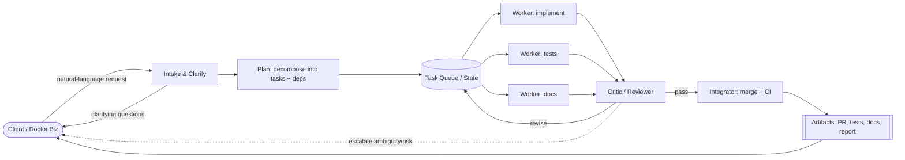

The **"living"** part: the team persists state between requests, learns the codebase, remembers decisions, picks up follow-ups, and interrupts you only at genuine decision gates.

Four properties define success:

| Property | What it means |
|---|---|
| **Autonomous** | Runs unattended request→PR; escalates only on real ambiguity/risk. |
| **Vendor-agnostic** | Any agent step runs on Claude, Codex, or a local model; swapping is config, not a rewrite. |
| **Dynamic** | The workflow is *generated* per request (decompose → plan → replan), not a hardcoded pipeline. |
| **Trustworthy** | Every output is verified (tests + adversarial critique) before it counts as done. |

---

## 3. Capability landscape — what's possible today

### 3.1 Claude side (Anthropic) — the most batteries-included worker

- **Claude Agent SDK** (Python `claude-agent-sdk` / TS `@anthropic-ai/claude-agent-sdk`) — the full Claude Code loop as a library, running on *your* infra. Built-in tools (`Read/Write/Edit/Bash/Glob/Grep/WebSearch`), subagents, sessions, permissions, hooks, MCP.

  ```python
  from claude_agent_sdk import query, ClaudeAgentOptions, ResultMessage
  async for msg in query(
      prompt="Find and fix the bug in auth.py",
      options=ClaudeAgentOptions(
          allowed_tools=["Read","Edit","Bash"],
          max_turns=30, max_budget_usd=5.0,   # hard cost cap
          permission_mode="acceptEdits",
      )):
      ...
  ```

- **Permission modes** (the autonomy knob): `default` (prompt via `canUseTool`), `plan` (explore, never auto-write), `acceptEdits` (auto-approve edits, gate Bash/network), `dontAsk` (only pre-approved tools run — **locked-down CI**), `bypassPermissions` (auto-approve all — *isolated containers only, dangerous*). Scoped rules like `Bash(git diff *)` + `disallowed_tools=["Bash(rm *)"]` give fine control.
- **Hooks** (lifecycle interception, for audit/enforcement/notify): `PreToolUse`, `PostToolUse`, `PostToolUseFailure`, `SubagentStart/Stop`, `PreCompact`, `Stop`, `SessionStart`, `Notification`. A `PreToolUse` hook can *deny* before anything else runs (e.g. block edits to `.env`).
- **Subagents** — spawn specialized agents with **isolated context** (no parent history), restricted toolsets, per-agent model/effort, and `background=True` for non-blocking. Max ~3 nesting layers. This is the native primitive for orchestrator-worker and hierarchical designs.
- **Headless / non-interactive** — `claude -p "<task>" --output-format json|stream-json`, `--json-schema` for structured output, `--resume <id>`, `--bare` for fast CI. The quickest "agent edits a repo → opens a PR" path.
- **Sessions** — resumable across processes/machines (`resume=id`), `fork_session=True` to branch an exploration without disturbing the original. Stored as JSONL; swap in an S3/DB `SessionStore` for serverless.
- **Anthropic API primitives** — **Tool Runner** (`client.beta.messages.tool_runner`, a client-side agentic loop over *your* tools; no built-in tools/sessions) and **Managed Agents** (Anthropic-hosted, REST+SSE, server-side state, cloud/self-hosted sandbox, native coordinator→worker orchestration). Use Managed Agents when you want Anthropic to host long-running async sessions; use the SDK when you own the infra.
- **Gotcha:** no built-in long-term memory — bring your own store. Rough cost: a PR review+fix+test cycle on Sonnet ≈ $0.08–0.10.

**Fit:** the strongest single-vendor autonomy story and the best default **worker runtime**. *(Docs: code.claude.com/docs/en/agent-sdk, /headless, platform.claude.com/docs/en/managed-agents)*

### 3.2 Codex / OpenAI side — a genuine peer worker

- **Codex CLI** — `@openai/codex`, rewritten in Rust; `codex` (interactive) / `codex exec "<task>"` (headless). Direct Claude Code analog. Approval modes read-only → auto-edit → **full-auto**, with **kernel-level sandbox** (container + fs/network restrictions) — architecturally stronger isolation than an app-layer prompt.
- **Codex Cloud** — hosted, sandboxed async SWE agent (research preview May 16 2025; `codex-1`, an o3 variant; later **GPT-5-Codex**, Sept 2025). Dispatch a task, it works in an isolated container, returns a diff / opens a PR. Built for fire-and-forget/overnight work — a natural **unattended worker**.
- **Codex SDK** (TypeScript) — embeds the same agent: thread/session create-resume-history, tool invocation, approval-policy config, custom **MCP** servers.
- **OpenAI Agents SDK** (successor to Swarm, MIT) — primitives: **Agents**, **Tools**, **Handoffs** (agent→agent delegation), **Guardrails** (parallel validators that can halt a run), **Sessions**, built-in **Tracing**. Drives **non-OpenAI models via LiteLLM** (`pip install "openai-agents[litellm]"` → `LitellmModel(model="anthropic/claude-...")`). Caveat: dashboard tracing + some hosted tools are OpenAI-model-only; pass `ModelSettings(include_usage=True)` off-platform. It's an in-process runner, **not** a durable engine.

**Fit:** a second interchangeable worker (Cloud = overnight autonomy) and an alternative orchestration SDK. Claude + Codex as swappable workers *is* the vendor-agnostic thesis in action. *(openai.com/index/introducing-codex, openai.github.io/openai-agents-python)*

### 3.3 Open-source orchestration & worker frameworks

| Framework | Model | Vendor-agnostic | License | Fit |
|---|---|---|---|---|
| **LangGraph** | Explicit graph, nodes+conditional edges, shared state, **checkpointing + time-travel** | Yes | MIT | **Best durable control plane**; stateful, HITL, replayable. Steepest setup. |
| **CrewAI** | Role-based crews (sequential/hierarchical), YAML DSL | Yes | MIT | Fast role-team prototyping; lower ceiling on complex branching. |
| **AutoGen / AG2** | Conversational `GroupChat`, event-driven core | Yes | MIT | Dynamic agent-to-agent discussion; AutoGen→AG2 split adds governance uncertainty. |
| **OpenHands** (ex-OpenDevin) | Full autonomous SWE agent (CodeAct: code-as-action), sandboxed, opens PRs | Yes | MIT | Highest turnkey autonomy (~77% SWE-bench Verified w/ strong Claude). A ready **worker**. |
| **SWE-agent** | Agent + Agent-Computer Interface; issue→patch | Yes | MIT | Clean, hackable. **mini-SWE-agent** ≈ 65% Verified in ~100 LOC — great minimal worker. |
| **Aider** | Terminal pair-programmer, **architect/editor split** (planner + cheap editor), git-native | Yes | Apache-2.0 | Superb model-agnostic **committing worker** (clean revertible commits). Not an orchestrator. |
| **Temporal** (+ AWS Lambda Durable Functions, Dec 2025) | Durable workflow engine: workflows+activities, deterministic replay | Model-agnostic | MIT core / Cloud commercial | The **reliability substrate**: runs for days/months, auto state-persistence, retries, timers, human-approval waits, replay/audit. |

**Takeaway:** these are complementary *layers*, not competitors. A robust fleet = **Temporal** (durable long-horizon control) → **LangGraph / Agents SDK** (per-task agent graphs) → **worker agents** (OpenHands / SWE-agent / Aider / Codex / Claude Code) → all model-routed via **LiteLLM**.

### 3.4 The vendor-agnostic abstraction layer

Three standards, three axes:

- **LiteLLM — the model routing plane** (MIT). One OpenAI-format API to 100+ providers. The **LiteLLM Proxy** (standalone gateway) adds declarative **fallbacks**, **routing strategies** (latency/cost/weighted; cost-based auto-picks cheapest), **virtual keys** (no provider-key exposure), budgets/rate-limits/RBAC. This is your "route this task to Claude OR Codex OR local" switch.
- **MCP — the tool/context plane.** Cross-vendor standard for exposing tools/resources. Consumed by Claude Code, Codex, OpenAI Agents SDK, and more. Write a GitHub/CI/filesystem tool **once**; every vendor's agent uses it. In the Agent SDK you can even define in-process tools with `@tool` + `create_sdk_mcp_server`.
- **A2A (Agent2Agent) — the agent-interop plane.** Google-announced Apr 2025, donated to the **Linux Foundation** Jun 23 2025. HTTP + SSE + JSON-RPC; **Agent Cards** advertise capabilities for discovery. **Complementary to MCP** (MCP = agent↔tool, A2A = agent↔agent). Caveat: academic analysis notes MCP/A2A still can't express key governance/authz semantics — adopt cautiously for sensitive delegation.

**The pattern:** models behind **LiteLLM**, tools behind **MCP**, long-horizon jobs wrapped in **Temporal**, per-task graphs in **LangGraph/Agents SDK**, cross-agent handoff via **A2A** later. "Which vendor" is config. **Everything in the core stack is MIT/Apache-2.0** — no license blocker; real cost is infra + API spend.

### 3.5 Reality check — the numbers that matter

- **SWE-bench Verified** (500 human-filtered real GitHub issues, test-gated) is the headline benchmark. Grounded scores: strong model + good harness ≈ **~70–77%**; mini-SWE-agent ≈ **65%** in ~100 LOC. The **85–95% figures in some 2026 blogs are unverifiable AI-generated SEO** — excluded here.
- **~20% of "solved" instances are semantically wrong** (pass by coincidence/reward-hacking). Leaderboards overstate real capability.
- **Poor uncertainty signaling** — wrong answers arrive with the same confident tone as right ones. *This is the core danger for unattended fleets.*
- **Context drift** over long runs — output becomes "functionally correct but awkward, overcomplicated, or subtly wrong."
- One enterprise study cited **~65% failure** on basic *unattended* business-process tasks; developer trust in AI accuracy fell YoY even as usage rose.

**Design implication (non-negotiable):** autonomy scales exactly as far as your ability to **automatically catch bad work**. Verification is the load-bearing wall — the model's self-report is not verification. Track *your own* held-out eval; public SWE-bench is contaminated/inflated. *(Sources §14.)*

---

## 4. Building blocks (shared by every architecture)

Every style below is assembled from the same parts — the "org infrastructure" of the team.

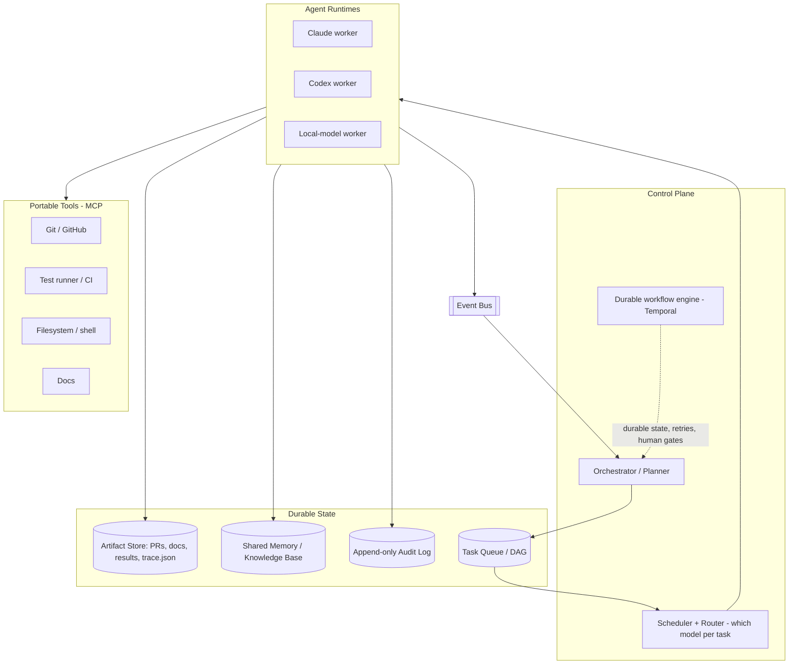

- **Control plane** — decides *what* to do and *which model* does it (orchestrator + router). Vendor-agnosticism lives here (LiteLLM routes Claude/Codex/local per task by capability/cost/latency).
- **Durable workflow engine (Temporal)** — the reliability substrate. Persists phase state, retries, timers, human-approval waits; **resume, don't restart** a failed run "from where the agent was."
- **Task store (DAG)** — the dependency graph of work; atomic claims (`SELECT ... FOR UPDATE SKIP LOCKED`) so agents never double-claim; retry/iteration counters; phase state persisted for exact resumption.
- **Shared memory / knowledge base** — repo map, ADRs, conventions, past decisions, retrieval embeddings. The *blackboard for facts* (read-heavy) — what makes the team *learn* the project. Agents summarize completed phases into external memory before proceeding.
- **Artifact store** — PRs, test reports, docs, `trace.json` (requirement→file→test). Client-facing outputs, versioned.
- **Event bus** — the nervous system: `task_claimed`, `branch_pushed`, `tests_failed`, `merge_conflict`, `human_gate_pending`. Decouples workers from orchestrator; enables async coordination and replanning.
- **Governance layer** — policy engine, access control, **append-only hash-chained audit log**, full tracing. Non-negotiable because agent behavior is non-deterministic between runs and errors compound.
- **Agent runtimes** — interchangeable execution environments (Claude Code, Codex CLI, OpenHands…) behind a common interface.
- **Portable tools (MCP)** — git, tests, filesystem, docs — written once, usable by any runtime.

---

## 5. The role model — an eng team mapped to agents

Model the fleet on a real team (as MetaGPT/ChatDev demonstrated). Each role = an **agent archetype** (system prompt + toolset + model tier).

| Role | Responsibility | Human gate? | Model tier |
|---|---|---|---|
| **Intake / PM** | Fuzzy request → crisp spec + acceptance criteria; clarifying questions | **Spec approval** | Strong reasoning |
| **Architect / Planner** | Decompose → task DAG; approach; ADRs | **Design approval** | Strong reasoning |
| **Implementer** | Code one scoped task, single-threaded, own branch/worktree | — | Mid/strong coding |
| **Tester** | Write tests **from the contract without seeing the implementation**; run them | — | Mid coding |
| **Reviewer / Critic** | Adversarially review the diff **against the contract**; try to *refute* | — | Strong reasoning |
| **Docs writer** | Docs, changelog, PR description | — | Cheap/mid |
| **Integrator / Release** | Merge queue, conflict resolution, CI gate, open PR | **Pre-release + final-merge** | Mid + tools |
| **Coordinator / Manager** | Assign work, track state, own escalation | — | Strong reasoning |

**Critical rule (from adversarial-review research): the maker never grades the checker.** Implementer ≠ Reviewer ≠ Tester — distinct agents, **no shared conversation history**. The router assigns cheap models to mechanical roles (docs, simple tests) and strong models to planning/critique — a major cost lever.

---

## 6. Architecture styles

The core. Each style wires the roles + building blocks differently. For each: **how it works, a diagram, pros, cons, when to use, cost/complexity, failure modes.**

### 6.1 Style A — Orchestrator–Worker (fan-out / fan-in)

**How it works:** One orchestrator decomposes the request into independent tasks, fans them out to parallel workers, collects results, verifies, integrates. The workhorse of production systems — and what Anthropic actually ships.

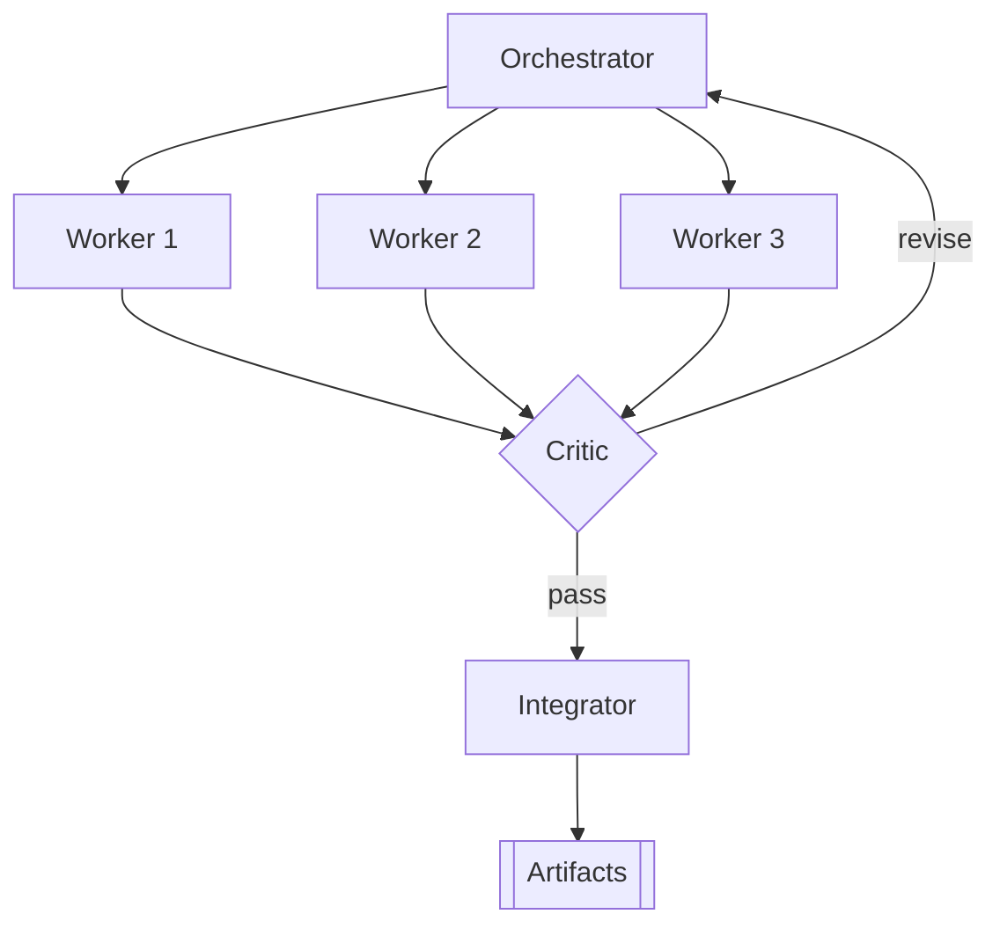

- **Pros:** Simple to reason about/debug; naturally parallel; bounded cost (fixed fan-out); clear place for verification; maps directly onto Claude subagents / Agents-SDK handoffs.
- **Cons:** Orchestrator is a bottleneck + single point of failure; assumes tasks separable up front; limited worker-to-worker collaboration.
- **When to use:** Most requests that decompose into independent chunks. **Best default.** Keep it **two-tier** (manager→worker).
- **Cost/complexity:** Low–medium.
- **Failure modes:** Bad decomposition cascades; workers duplicate/conflict on vague briefs (Anthropic saw exactly this — briefs need *objective + output format + boundaries*); orchestrator context bloat.

### 6.2 Style B — Hierarchical (manager → leads → workers)

**How it works:** Add layers. Manager splits into sub-projects, each owned by a **lead** that further decomposes and manages its own workers. Recursion of Style A.

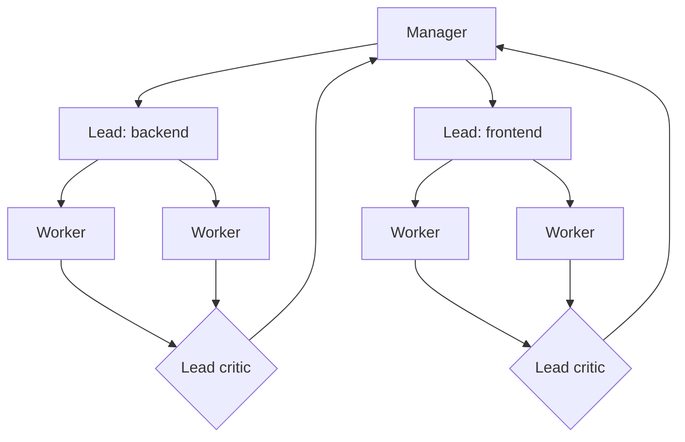

- **Pros:** Scales to large multi-subsystem work; context stays local per branch (no single bloated context); leads specialize.
- **Cons:** Coordination + latency tax per tier; error compounding down the chain ("one step failing sends agents down entirely different trajectories"); higher token cost; harder to debug.
- **When to use:** Large features spanning genuinely independent subsystems (frontend/backend/infra), each with its own integration boundary. **Overkill otherwise.**
- **Cost/complexity:** Medium–high.
- **Failure modes:** "Telephone game" drift across layers; lead-level replanning loops; cost blowups if depth isn't bounded.

### 6.3 Style C — Blackboard / shared-memory

**How it works:** No fixed hierarchy. Agents read/write a shared workspace; each acts on conditions it can address; a controller picks which contribution to apply next.

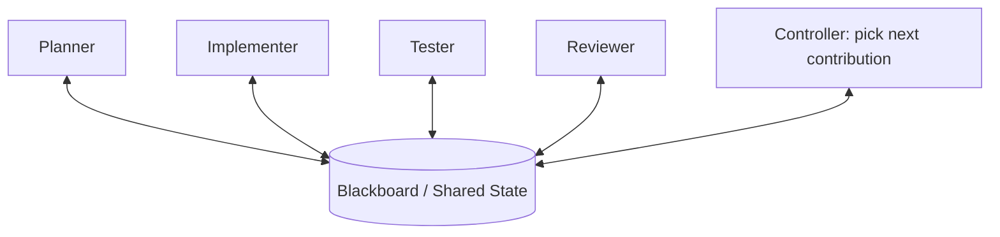

- **Pros:** Flexible/emergent; loosely coupled (easy to add/remove specialists); resilient to partial failure; natural fit for a durable knowledge base.
- **Cons:** Hard to predict/control; thrashing/livelock risk; needs a strong controller policy; poor observability.
- **When to use:** Exploratory/research-heavy work, debugging mysteries. **Use it for *facts*, not for *who-edits-what*** — implicit coordination over shared code is exactly what produces the ~19.8% conflict rate.
- **Cost/complexity:** Medium; the controller policy is the hard part.
- **Failure modes:** Board contention; agents overwriting each other; non-convergence without a strong controller.

### 6.4 Style D — Market / bidding (contract-net)

**How it works:** Tasks are auctioned. The coordinator posts a task; capable agents **bid** (confidence/cost/ETA); best bid wins. Naturally routes work to the best-suited *and cheapest* agent — Claude vs Codex vs local *bid* per task.

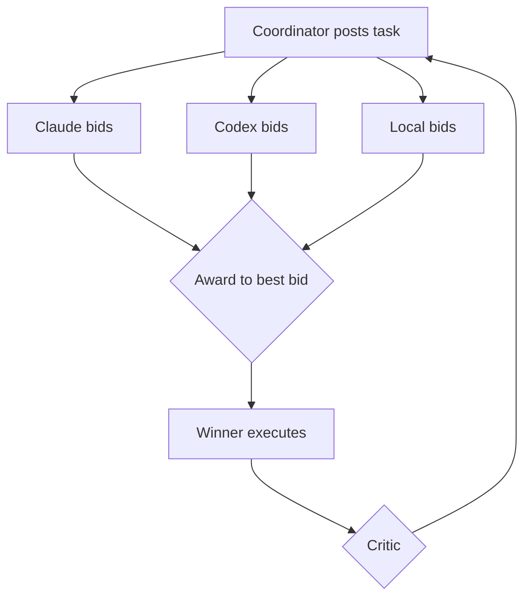

- **Pros:** Self-optimizing cost/capability routing; decentralized load balancing; vendor-agnosticism falls out naturally.
- **Cons:** Bidding adds latency + token overhead; agents misjudge their own confidence; needs trustworthy scoring/settlement.
- **When to use:** Heterogeneous fleets with very different model strengths, or when cost optimization is first-class. **A scaling escape hatch, not a v1.**
- **Cost/complexity:** Medium–high.
- **Failure modes:** Overconfident bids winning bad work; auction overhead dominating small tasks; gaming the scoring.

### 6.5 Style E — Peer-to-peer / swarm (handoff)

**How it works:** No central boss. Agents hand off directly to whichever peer should act next (OpenAI Agents SDK "handoffs," AutoGen group chat).

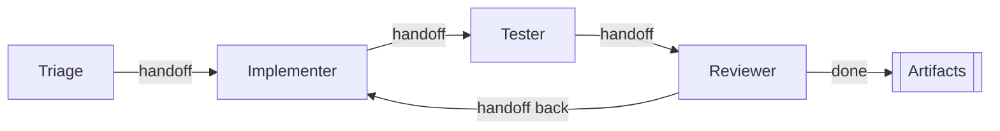

- **Pros:** Minimal central bottleneck; very flexible/conversational; easy "if X hand to Y"; low ceremony.
- **Cons:** Hard to guarantee termination/global progress; diffuse state; loops; hardest to audit and bound cost.
- **When to use:** Small teams of agents on open-ended problems; prototyping. **Premature for autonomous SWE** — real-time agent coordination is still immature; avoid designs that *depend* on it.
- **Cost/complexity:** Low to build, high to *control*.
- **Failure modes:** Infinite handoff loops; no owner of "done"; cost runaways.

### 6.6 Cross-cutting axis — fixed pipeline vs dynamic planning

Independent of topology: *how rigid is the workflow?* The false dichotomy is "rigid DAG vs free-for-all." **The right answer is a fixed *lifecycle* wrapping dynamic *plans*.**

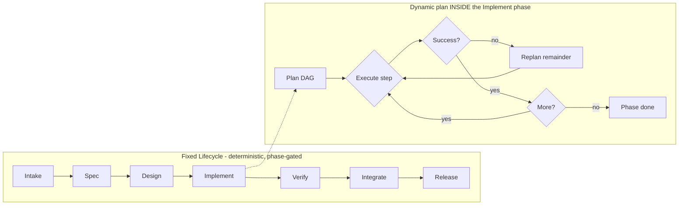

- **Fixed pipeline** — deterministic, cheap, auditable, easy to gate; brittle when reality deviates. Great for *routine* changes.
- **Dynamic (plan-and-execute + replan)** — planner emits a task DAG; failures trigger **replanning of the remainder** (not blind retry). Flexible; costs more.
- **Recommendation:** the **deterministic phase-gated lifecycle** (phase *n* can't start until *n−1* ends, with hard invariants) wrapping **dynamic in-phase planning**. Determinism in the harness, autonomy inside phases.

### 6.7 Style comparison at a glance

| Style | Control | Parallelism | Flexibility | Cost | Debuggability | Best for |
|---|---|---|---|---|---|---|
| A. Orchestrator–Worker | Central | High | Medium | Low | High | **Default**; separable tasks |
| B. Hierarchical | Layered | High | Medium | High | Medium | Large multi-subsystem work |
| C. Blackboard | Shared/controller | Medium | High | Medium | Low | Exploratory / debugging (facts only) |
| D. Market/bidding | Auction | High | High | Med-High | Medium | Cost/capability routing at scale |
| E. Peer-to-peer | Decentralized | Medium | High | Variable | Low | Small, open-ended teams |

---

## 7. Dynamic workflow generation

How the planner turns *"add OAuth login"* into a live task graph — and adapts. Planning-pattern guidance from the research:

- **Plan-and-Execute at the top (with replanning)** — separate *planner* (makes the DAG) from *executors* (do tasks). Front-loads cost to planning, executes cheaply, assesses failures "in the context of the entire plan." **Your top-level pattern.**
- **ReAct inside each worker (budgeted!)** — reason→act→observe for one task. Its failure mode is dangerous: it plans one step at a time and can **loop on a failed action** (a documented 2025 incident: four agents looped **11 days and billed $47,000**). **Never run ReAct without a step/cost budget and a loop-breaker.**
- **Reflection must be cross-agent, not a self-loop** — single-agent Reflexion "consistently repeats earlier misconceptions" because the same model generates output *and* critique. Route critique to a **different agent/model**.
- **Tree-of-Thoughts** — reserve for genuinely branchy *design* decisions (2–3 candidate architectures), not line-level coding.
- **Decompose → DAG → queue:** each task gets an acceptance criterion, a file/module scope, and explicit `depends-on` edges. Topologically schedule: **parallelism ≤ the DAG's independent frontier** (spawning more agents than there's independent work just manufactures conflicts). Atomic claims via `SKIP LOCKED`.
- **Replan as a first-class component** — a failed task re-enters the planner to re-scope/split/add-a-dependency/escalate, not blind-retry. (Honest limitation: *online* replanning under mid-execution failure is still weak in DAG models — design the replanner deliberately.)

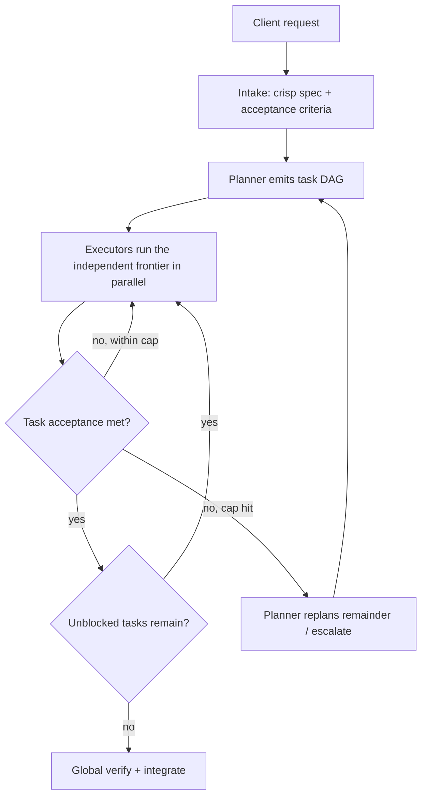

---

## 8. Safe parallelism — many agents, one repo

The biggest operational risk is agents clobbering each other. The research is unambiguous: **git worktrees are the missing primitive.**

- **Branch-per-task + git worktrees** — each worker gets its **own worktree** (`git worktree add ../wt-task-123 -b task/123`) → full filesystem isolation, no silent overwrites, no git-lock contention. (First-class IDE support now: JetBrains 2026.1, VS Code Jul 2025.)
- **Claim at *task* granularity, not file** — the planner pre-scopes each task to a file set; **partition so scopes don't overlap** rather than lock files at runtime. The cheapest conflict is the one the plan prevented.
- **Serialized integration queue** — workers **never** merge to main. All branches route through a **FIFO merge queue** that rebases + tests each branch against current main before merging. An **integrator agent** owns it.
- **Conflict-resolution ladder:** (a) auto-rebase if clean → (b) auto-resolve mechanical conflicts (imports, changelog) with a resolution agent → (c) bounce back to the originating implementer with the conflict as context → (d) escalate to human.
- **CI as the hard gate** — nothing merges without green CI in a clean environment. **Main is sacred and serialized.**

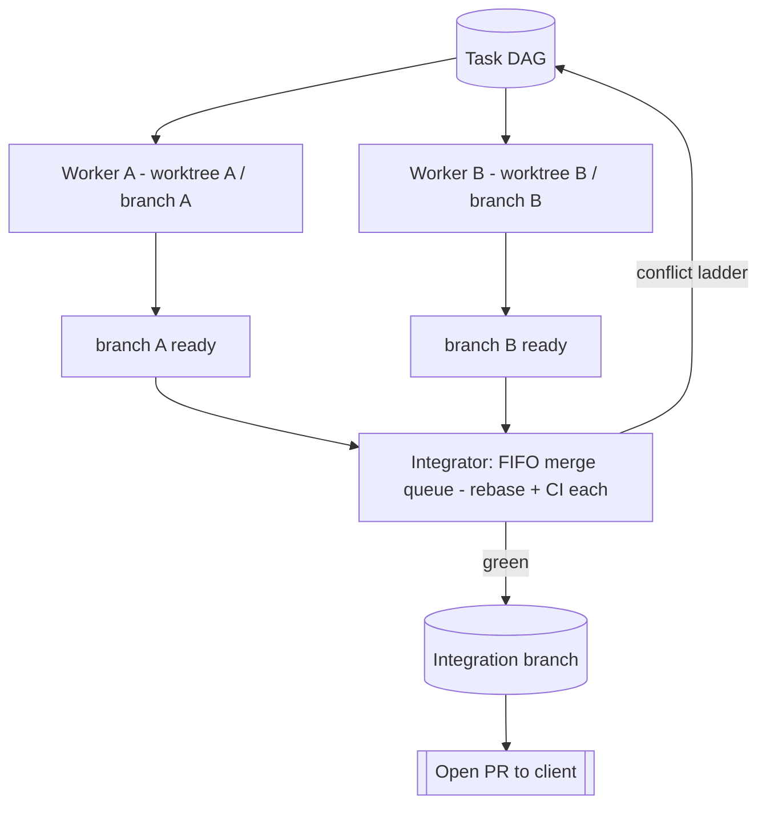

> This environment already offers per-agent **git worktree isolation** — strong evidence it's the right call. Keep branches **small and short-lived**; conflict probability rises with branch lifetime and scope overlap.

---

## 9. Verification & the critique-improve loop (the trust backbone)

Autonomy is only as safe as verification is strong. The core threat is **plausible-but-wrong work** — a model that just wrote code "hallucinates correctness" because it *looks* plausible and tests are green. Defeating this is an **architecture** problem, not a prompt problem. This is where the **critique-improve loop** becomes a first-class citizen — both *our* process for this doc and a core pattern *inside* the fleet.

**The maker-checker principle, enforced structurally:** *"When the agent controls verification itself, it is no longer verification but self-confirmation."*

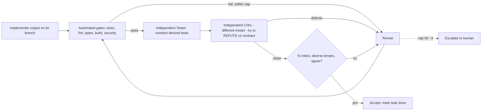

Principles that make it actually work:

1. **Automated gates first** — tests, linters, type-checkers, build, security scan. Cheap, objective, fail-closed. *"Test output must be pristine."*
2. **Structural independence** — Builder / Critic / Tester are **separate agents, separate payloads, separate queues, no shared history**. The verifier sees **the contract, not the implementation's reasoning** (so it can't be talked into agreeing). Tester writes tests from the contract **without seeing the implementation**.
3. **Adversarial + diverse + voting** — critics prompted to *refute* ("default to reject if uncertain"), each with a different lens (correctness, security, does-it-run, matches-spec). Accept on majority. Diversity beats redundancy.
4. **Machine-checkable Definition of Done** — a `trace.json` linking **requirement → file → test**. Spec is **content-hashed at approval**; a **drift check** flags any file changed outside a registered acceptance-criterion scope. "Done" = every AC has implementing files + passing tests, no un-scoped changes, clean security scan. (Honest caveat: trace linkage is *detect* post-hoc, not *prevent* — HITL is the final backstop.)
5. **Hard iteration cap (~3, range 1–5) then escalate** — LLM debugging effectiveness "decays sharply within 2–3 attempts." The cap is your defense against *both* confident-wrong output *and* the $47k runaway loop.
6. **Loop-until-dry** — keep critiquing until N consecutive rounds surface nothing material. (Exactly the loop we're running on *this document*.)

This loop is what lets you *trust* an unattended fleet. Without it, autonomy is just fast wrongness. (OpenAI's "scaling code verification" work points the same way: verification, not generation, is the bottleneck.)

---

## 10. Client interaction model

The experience should feel like a competent remote team over an issue tracker — **async with well-placed synchronous gates.**

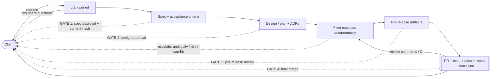

- **Four human gates** are the minimum viable trust structure: **spec, design, pre-release, final-merge.** Everything between runs autonomously.
- **Clarify before building** — the intake agent asks *few, sharp* questions (like the ones that opened this very task). Cheap to ask; expensive to build the wrong thing.
- **Escalation, not guessing** — on ambiguity, a risky/irreversible action, or the iteration cap, the fleet **pauses and routes a specific question** rather than looping or guessing.
- **Deliver artifacts, not process** — you review a PR (with the `trace.json` AC→file→test mapping in the description) + a plain-language report, not the transcript.
- **Feedback → replan** — a gate rejection resets that phase (iteration counters reset — "reviewer rejection is a new mandate"); PR review comments / CI failures feed back as new tasks (the PR-watching loop).

---

## 11. Iterations: simple → ambitious

Do **not** build the ambitious version first. Each stage ships value and de-risks the next.

### V0 — Single autonomous worker + adversarial checker (days)
One headless coding agent (Claude Code `-p` or `codex exec`) behind a script: task → **one branch** → tests → PR. Add **one independent Critic + one independent Tester** (maker ≠ checker), a CI gate, and a 3-iteration cap. Two gates: spec approval, final merge. **No cross-task parallelism.** You get the trust backbone — the thing that actually matters — at the highest ROI-to-complexity point.
- *Adds:* worker runtime, MCP tools, CI gate, PR creation, adversarial verification, iteration cap.

### V1 — Orchestrated fleet with merge queue (1–2 weeks)
Style A, two-tier. Planner builds a DAG; implementers fan out **only across the independent frontier**, each in its own **worktree/branch**; independent Critic + Tester per task; **FIFO merge queue** + conflict ladder owned by an integrator; **event bus**; `trace.json` DoD; full tracing + audit log. Single vendor to start. Fixed lifecycle, dynamic in-phase plan.
- *Adds:* task queue w/ atomic claims, orchestrator, safe parallelism, integrator, event bus, DoD traceability.

### V2 — Vendor-agnostic + dynamic + durable (3–6 weeks)
Add the **LiteLLM router** (Claude/Codex/local per step) + portable **MCP tools**; wrap long-horizon jobs in **Temporal** (durable state, retries, human-approval waits, replay); add **dynamic replanning**, **durable knowledge base** (team survives restarts, learns the repo), and the **four-gate** client model with escalation policy.
- *Adds:* model router, durable workflow engine, replanner, knowledge base, escalation gates.

### V3 — Living fleet (ongoing)
Persistent team: long-term memory/knowledge base, cost-aware routing (optionally **market/bidding**), self-monitoring/watchdog, scheduled/triggered runs, PR-watching feedback loops, observability dashboards. Switch on **hierarchical** topology for large programs. The "living team."
- *Adds:* knowledge base maturity, bidding/routing optimization, schedulers/triggers, fleet-health watchdog, dashboards.

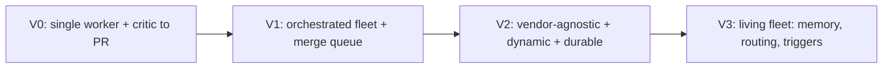

---

## 12. Final recommendation (for you, Doctor Biz)

Given your constraints — **vendor-agnostic, fully autonomous, general SWE work, proven on a throwaway repo first** — the opinionated call:

### 12.1 The recommended architecture

**A deterministic phase-gated control plane orchestrating a small two-tier Orchestrator–Worker fleet (Style A), with git-worktree isolation, a serialized merge queue, structurally-independent adversarial verification, and four human gates — growing a hierarchical tier (Style B) only when a job genuinely decomposes into subsystems.**

The stack (all MIT/Apache-2.0 in the core):

| Layer | Choice | Why |
|---|---|---|
| **Durability / long-horizon** | **Temporal** | Days-long runs, state persistence, retries, human-approval waits, replay/audit. Resume, don't restart. |
| **Per-task orchestration** | **LangGraph** (runner-up: OpenAI Agents SDK) | Explicit durable graph, cycles, HITL, checkpointing/time-travel — best fit for dynamic-workflow-that-survives-restarts. |
| **Model routing** | **LiteLLM proxy** | Route each node to best/cheapest model — Claude for planning/critique, Codex/local for mechanical coding. This *is* your vendor-agnosticism. |
| **Tools** | **MCP servers** (git/GitHub, tests, fs, docs) | Write once, every runtime uses them. |
| **Workers** | **Claude Code** + **Codex** (Cloud for overnight), each in its **own worktree/branch**; Aider/OpenHands/SWE-agent optional | Interchangeable headless coding runtimes. |
| **Verification** | Automated gates → independent Tester → independent multi-critic vote, iteration cap ~3 | Makes "fully autonomous" *safe*. |
| **Interop (later)** | **A2A** | Cross-framework handoff once its governance story firms up. |

**Topology default = Style A (two-tier).** Escalate to **Style B** per-job on multi-subsystem scope. Keep **Style D (bidding)** in your back pocket as a *routing policy* once cost optimization matters. Use **Blackboard** only as the *knowledge base* (facts), never as the coordination mechanism.

### 12.2 Why not the others as primary

- **Peer-to-peer (E):** can't guarantee termination or bound cost unattended; real-time agent coordination is immature. Demo-grade for now.
- **Blackboard (C) as control:** implicit coordination over shared code drives the ~19.8% conflict rate. Adopt its *shared knowledge base*, not its control model.
- **Hierarchical (B) from day one:** premature — you pay the ~15× token tax and error-compounding before proving V1.
- **Market/bidding (D) from day one:** auction overhead isn't worth it until the fleet is genuinely heterogeneous and cost-sensitive.

### 12.3 Decision matrix — pick the style per situation

| If the job is… | Use | Because |
|---|---|---|
| A normal feature/bugfix with separable parts | **A: Orchestrator–Worker** | Simple, parallel, cheap, well-gated |
| Large, spans genuinely independent subsystems | **B: Hierarchical** | Local context per subsystem, scales |
| Exploratory / a debugging mystery | **C: Blackboard** (facts) for that job | Emergent, opportunistic specialists |
| Cost-sensitive with very different model strengths | **D: Bidding** routing | Self-optimizes cost/capability |
| Tiny, open-ended, fast prototype | **E: Peer-to-peer** | Low ceremony |
| Routine, well-understood change | **Fixed pipeline** | Deterministic, cheap, auditable |
| Novel / uncertain path | **Dynamic + replan** | Adapts to discoveries |

### 12.4 Phased roadmap

1. **Prove V0** on the throwaway repo: one headless worker + independent critic/tester → branch → tests → PR, 3-iteration cap. (Days.)
2. **Build V1**: LangGraph orchestrator + 2–3 worktree workers + adversarial critic/tester + FIFO merge queue + integrator + event bus + `trace.json`, single vendor. (1–2 weeks.)
3. **Go vendor-agnostic + durable (V2)**: LiteLLM routing + MCP tools + Temporal + dynamic replanning + knowledge base + four-gate escalation. (3–6 weeks.)
4. **Grow the living fleet (V3)**: knowledge base, cost-aware/bidding routing, schedulers/triggers, PR-watching, watchdog, dashboards. (Ongoing.)

**Ship V0 and V1 before touching V2.** The critique-improve loop goes in at V0 and never leaves.

---

## 13. Risks, cost, and guardrails

| Risk | Mitigation |
|---|---|
| **Plausible-but-wrong work** | Structurally-independent adversarial critic (maker≠checker) + tests as hard gate; verifier sees contract not code; nothing merges without green CI |
| **Confident wrong answers (poor uncertainty signaling)** | Independent verification is the gate, *never* the model's self-report; diverse-lens critic vote |
| **Cost runaway ($47k-loop class)** | Iteration cap ~3 + per-agent step/cost budgets (`max_budget_usd`); bounded fan-out; cheap models for mechanical roles; kill-switch; reserve fleet for high-value work (15× token tax) |
| **Agents clobbering each other (~19.8% conflict)** | Worktree/branch-per-task isolation; task-granular scoping; serialized FIFO merge queue; small short-lived branches |
| **Infinite loops / non-termination** | Bounded replans + retries; a coordinator that owns "done"; global job timeout |
| **Irreversible/risky actions** | Escalation gate; `permission_mode=dontAsk` + allowlist; PreToolUse hooks; no force-push/secrets/deploys without approval |
| **Vendor lock-in** | LiteLLM + MCP abstraction from V2; never hardcode a provider in business logic |
| **Silent scope drift** | Spec content-hash + drift check; critic checks output *against contract* |
| **Non-deterministic behavior between runs** | Full tracing + append-only hash-chained audit log from day one; externalize all state (resume, don't restart) |
| **Benchmark over-trust** | Ignore inflated public SWE-bench; maintain your *own* held-out eval on your repos |

---

## 14. Sources

**Anthropic / Claude:** [Agent SDK](https://code.claude.com/docs/en/agent-sdk/overview.md), [Subagents](https://code.claude.com/docs/en/agent-sdk/subagents.md), [Permissions](https://code.claude.com/docs/en/agent-sdk/permissions.md), [Hooks](https://code.claude.com/docs/en/agent-sdk/hooks.md), [Headless](https://code.claude.com/docs/en/headless.md), [Tool Runner](https://platform.claude.com/docs/en/agents-and-tools/tool-use/tool-runner.md), [Managed Agents](https://platform.claude.com/docs/en/managed-agents/overview.md), [How we built our multi-agent research system](https://www.anthropic.com/engineering/multi-agent-research-system).

**OpenAI / Codex:** [Introducing Codex](https://openai.com/index/introducing-codex/), [Agents SDK](https://openai.github.io/openai-agents-python/), [Agents SDK + LiteLLM](https://github.com/openai/openai-agents-python/blob/main/docs/models/litellm.md), [Scaling code verification](https://alignment.openai.com/scaling-code-verification/).

**OSS frameworks:** [LangGraph vs AutoGen vs CrewAI](https://latenode.com/blog/platform-comparisons-alternatives/automation-platform-comparisons/langgraph-vs-autogen-vs-crewai-complete-ai-agent-framework-comparison-architecture-analysis-2025), [OpenHands (ICLR 2025)](https://proceedings.iclr.cc/paper_files/paper/2025/file/a4b6ad6b48850c0c331d1259fc66a69c-Paper-Conference.pdf), [SWE-agent](https://github.com/SWE-agent/SWE-agent) ([paper](https://arxiv.org/abs/2405.15793)), [Aider](https://www.deployhq.com/guides/aider), [Temporal for AI](https://temporal.io/solutions/ai).

**Abstraction layer:** [LiteLLM docs](https://docs.litellm.ai/), [LiteLLM proxy](https://joshuaopolko.com/litellm-proxy-guide/), [Linux Foundation A2A launch](https://www.linuxfoundation.org/press/linux-foundation-launches-the-agent2agent-protocol-project-to-enable-secure-intelligent-communication-between-ai-agents), [Governance gaps in interop protocols](https://arxiv.org/pdf/2606.31498).

**Architecture & patterns:** [Deterministic Control Plane for LLM Coding Agents](https://arxiv.org/html/2606.26924v1), [Contract-Driven Adversarial Verification](https://arxiv.org/pdf/2605.25665), [AI Agent PRs: merge conflict rates](https://arxiv.org/pdf/2607.04697), [Adversarial Code Review](https://www.augmentcode.com/guides/adversarial-code-review) / [ASDLC](https://asdlc.io/patterns/adversarial-code-review/), [AI code-review loop verification](https://www.codecentric.de/en/knowledge-hub/blog/ai-code-review-loop-verification), [Git worktrees for parallel agents](https://www.augmentcode.com/guides/git-worktrees-parallel-ai-agent-execution), [ReAct vs Plan-and-Execute vs Reflexion](https://theaiengineer.substack.com/p/the-4-single-agent-patterns), [Agent control plane (IBM)](https://www.ibm.com/think/topics/agent-control-plane), [Event-driven agentic systems (Confluent)](https://www.confluent.io/blog/autonomous-agentic-event-driven-systems-architecture/).

**Reality check:** [SWE-bench Verified](https://llm-stats.com/benchmarks/swe-bench-verified), [UTBoost: rigorous eval / false-positive solves](https://arxiv.org/pdf/2506.09289), [SWE-bench Goes Live](https://arxiv.org/pdf/2505.23419), [How Coding Agents Fail Their Users (20,574 sessions)](https://arxiv.org/pdf/2605.29442).

> **Citation caveat:** several 2026-dated arXiv preprints (2606.x, 2607.x) are very recent; verify final citation forms before external publication. Forward-dated model names and 85–95% SWE-bench figures circulating in some 2026 blogs could **not** be corroborated against primary sources and are deliberately excluded from load-bearing claims.

---

*v2 is research-grounded. Next: run the adversarial critique-improve loop until the success criteria — every style covered with pros/cons/failure-modes, all iterations, and a decisive recommendation — are provably met, then build the visual artifact.*
