<!-- ABOUTME: Design research for a vendor-agnostic, supervised-autonomy software-engineering agent fleet. -->
<!-- ABOUTME: Covers the capability landscape, every architecture style with pros/cons, economics, and a phased recommendation. -->

# The Living Engineering Team: A Vendor-Agnostic Autonomous Agent Fleet

> **Status:** v3 (research-grounded + survived one full adversarial critique-improve round)
> **Author:** Claude (with Doctor Biz)
> **Goal (aspiration):** A system where a human *client* submits work in natural language and a self-organizing fleet of AI agents plans, implements, tests, reviews, documents, and ships it — like a living software team — vendor-agnostic (Claude, Codex, local models) and as autonomous as verification can safely support.

---

## 0. Honest framing — what this is, and what it is not (read first)

The request was a "fully autonomous" fleet. After a hard design review, here is the honest position this document takes — because selling you fantasy would waste your money:

> **Today's realistic target is *supervised autonomy within bounded phases*, with a configurable "autonomy dial" that opens up as your verification earns trust — not lights-out full autonomy.**

Three truths force this:

1. **Verification cannot yet be fully trusted.** LLM critics catch regressions and test-covered defects well, but have a high false-negative rate (realistically 20–40%) on *subtle semantic* and *spec-misunderstanding* bugs — the exact class autonomy most needs to catch. Critics drawn from the same model family have **correlated** errors, so majority voting helps less than it appears (voting only decorrelates *independent* errors). See §9.
2. **Because of #1, humans stay on the critical path** at a few gates. That is a feature, not a failure — but it means the human, not the fleet, is the safety backstop, and at high volume the human is the throughput bottleneck. The design must make each human touch cheap and rare, and must be honest that it is there.
3. **The economics only close for high-value work.** A fleet job costs plausibly **30–100× a single agent call** (many strong-model critic votes dominate). If a human still reviews every job, you pay fleet-scale tokens *and* human time. This beats "one engineer + one interactive agent" only when work is **parallel, well-specified, and high-value**, and it loses when work is small, ambiguous, or cheap. §12 gives a GO/NO-GO threshold.

**So the deliverable is a design that is decisive about architecture, honest about limits, and staged so you prove value cheaply (V0) before spending on the ambitious version.** Where autonomy is safe, the dial opens; where it isn't, a gate stays closed. That is the whole philosophy.

---

## 1. How to read this document

1. **The disciplining truth** — why this isn't a swarm.
2. **The autonomy dial** — how "fully autonomous" is a configurable spectrum, not a binary.
3. **Capability landscape** — Claude, Codex, OSS, the abstraction layer (API shapes + citations).
4. **Building blocks** — the shared org-infrastructure.
5. **Role model** — an eng team mapped to agents.
6. **Architecture styles** — *every* viable style, each with how-it-works / pros / cons / when-to-use / cost / failure-modes; plus styles considered-and-rejected.
7. **Dynamic workflow generation**, 8. **Safe parallelism**, 9. **Verification & the critique-improve loop**, 10. **Security threat model**, 11. **Client interaction & the autonomy dial in practice**.
12. **Economics & GO/NO-GO**, 13. **Iterations V0→V3**, 14. **Final recommendation**, 15. **Risks**, 16. **Testing/observing/operating the fleet**, 17. **Appendix: concrete schemas & build order**, 18. **Sources**.

---

## 2. The disciplining truth (why this is not a swarm)

The most important finding, and it shapes everything:

> **Software engineering is a poor fit for naive breadth-first multi-agent parallelism.** Anthropic's multi-agent team reports coding tasks "involve fewer truly parallelizable tasks than research, and LLM agents are not yet great at coordinating and delegating in real time," and that multi-agent systems burn **~15× the tokens of a chat interaction**. A recent (2026, single-preprint, *directional not settled*) study reports a **~20% textual conflict rate between parallel agent instances** on shared code.

The winning shape is therefore **not** "swarm 20 agents":

> A **thin, deterministic control plane** orchestrating a **small number of strongly-isolated, single-threaded worker agents**, coordinated by the **dependency structure of the work** and **git isolation**, with **adversarial verification + human gates** as the trust backbone.

Autonomy lives *inside bounded phases*; determinism lives *in the harness*. Reserve the fleet for high-value, parallelizable, well-specified work.

---

## 3. The autonomy dial — "fully autonomous" as a spectrum

"Fully autonomous" is not one setting; it's a **per-risk-tier policy**. The same fleet runs at different dial positions for different work:

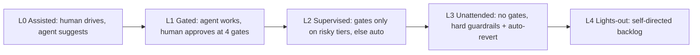

| Dial | Human gates | When appropriate | Extra guardrails required |
|---|---|---|---|
| **L1 Gated** | spec + design + pre-release + final-merge | New codebase, low trust, high stakes | Baseline |
| **L2 Supervised** | only spec + final-merge for low-risk tiers | Proven fleet, well-understood repo | Risk classifier per task; auto-approve low-risk |
| **L3 Unattended** | none; async escalation only | Sandboxed/throwaway repos, bulk mechanical work | Kernel sandbox, network egress denylist, **auto-revert on post-merge failure**, per-job budget hard-stop, safe-state-on-timeout |
| **L4 Lights-out** | none; picks own backlog | Aspirational; requires measured low escaped-defect rate | Everything in L3 + a trusted held-out eval proving critic catch-rate |

**Escalation-with-no-human (the 3am problem):** when an escalation fires and no human answers within the gate SLA, the job must reach a **safe state** — park the branch (never merge), snapshot state for resume, notify, and free the worker's claim. Never block a worker indefinitely; never auto-merge past an unanswered gate.

**The dial is the honest answer to "fully autonomous":** you *can* run L3/L4 on a throwaway repo (which is exactly your test target) — that's where you'll prove it — but you open the dial as your own eval shows the critic catch-rate is high enough to trust. Start at L1.

---

## 4. Capability landscape — what's possible today

### 4.1 Claude side (Anthropic) — the most batteries-included worker

- **Claude Agent SDK** (Python `claude-agent-sdk` / TS `@anthropic-ai/claude-agent-sdk`) — the Claude Code loop as a library on *your* infra. Built-in tools (`Read/Write/Edit/Bash/Glob/Grep/WebSearch`), subagents, sessions, permissions, hooks, MCP.

  ```python
  from claude_agent_sdk import query, ClaudeAgentOptions, ResultMessage
  async for msg in query(
      prompt="Find and fix the bug in auth.py",
      options=ClaudeAgentOptions(
          allowed_tools=["Read","Edit","Bash"],
          max_turns=30, max_budget_usd=5.0,   # hard cost cap (verified real)
          permission_mode="acceptEdits"))：
      ...
  ```

- **Permission modes** *(verified against docs)*: `default` (prompt via `canUseTool`), `plan` (explore, never auto-write), `acceptEdits`, `dontAsk` (only pre-approved tools — **locked-down CI**), `bypassPermissions` (auto-approve all — *isolated containers only*). Scoped rules like `Bash(git diff *)` + `disallowed_tools=["Bash(rm *)"]`.
- **Hooks** *(verified)*: `PreToolUse`, `PostToolUse`, `PostToolUseFailure`, `SubagentStart/Stop`, `PreCompact`, `Stop`, `SessionStart`, `Notification`. `PreToolUse` can **deny** before anything runs — the enforcement point for the §10 threat model.
- **Subagents** — specialized agents with **isolated context**, restricted toolsets, per-agent model/effort, `background=True`. **Correction from v2:** subagents generally **cannot themselves spawn subagents** — nesting is effectively *one level*. **Implication:** hierarchical (manager→lead→worker) topologies must be built at *your orchestration layer*, not via native subagent recursion.
- **Headless** — `claude -p "<task>" --output-format json|stream-json`, `--json-schema`, `--resume <id>`, `--bare` for fast CI. Quickest "edit repo → open PR" path.
- **Sessions** — resumable across processes (`resume=id`), `fork_session=True` to branch an exploration. JSONL-backed; swap an S3/DB `SessionStore` for serverless.
- **Anthropic API primitives** — **Tool Runner** (`client.beta.messages.tool_runner`, client-side loop over *your* tools; no built-in tools/sessions) and **Managed Agents** (Anthropic-hosted, REST+SSE, server-side state, cloud/self-hosted sandbox, coordinator→worker orchestration).
- **Gotchas:** no built-in long-term memory (bring your own). Cost of a full agentic review+fix+test cycle on a mid-tier model is realistically **order $0.50–several dollars** depending on repo size and iterations — *not* cents (v2 understated this).

**Fit:** strongest single-vendor autonomy story; best default **worker runtime**. *(code.claude.com/docs/en/agent-sdk, /headless; platform.claude.com/docs/en/managed-agents)*

### 4.2 Codex / OpenAI side — a genuine peer worker

- **Codex CLI** — `@openai/codex` (Rust); `codex` / `codex exec "<task>"`. Approval modes read-only → auto-edit → full-auto, with **kernel-level sandbox** (stronger isolation than app-layer prompts).
- **Codex Cloud** — hosted async SWE agent (research preview May 16 2025; `codex-1`, an o3 variant; later **GPT-5-Codex**, Sept 2025). Dispatch → isolated container → diff/PR. Natural **unattended worker**.
- **Codex SDK** (TS) — embeds the same agent (thread create/resume/history, tools, approval policy, MCP).
- **OpenAI Agents SDK** (MIT, successor to Swarm) — **Agents / Tools / Handoffs / Guardrails / Sessions / Tracing**; drives non-OpenAI models **via LiteLLM** (`openai-agents[litellm]` → `LitellmModel(model="anthropic/claude-...")`). Caveat: dashboard tracing + some hosted tools are OpenAI-model-only (`ModelSettings(include_usage=True)` off-platform). In-process runner, **not** durable.

**Fit:** second interchangeable worker (Cloud = overnight autonomy) + alt orchestration SDK. *(openai.com/index/introducing-codex; openai.github.io/openai-agents-python)*

### 4.3 Open-source orchestration & worker frameworks

| Framework | Model | Vendor-agnostic | License | Fit |
|---|---|---|---|---|
| **LangGraph** | Explicit graph + shared state + checkpointing | Yes | MIT | Per-task agent graph engine (see §4.5 on durability overlap with Temporal). |
| **CrewAI** | Role-based crews | Yes | MIT | Fast role-team prototyping; lower ceiling on branching. |
| **AutoGen / AG2** | Conversational GroupChat | Yes | MIT | Dynamic agent conversation; AutoGen→AG2 split adds governance uncertainty. |
| **OpenHands** (ex-OpenDevin) | Full autonomous SWE agent (CodeAct) | Yes | MIT | High turnkey autonomy (**~70%+** SWE-bench Verified for a specific model+scaffold; treat exact % as model/date-dependent). Ready **worker**. |
| **SWE-agent** | Agent + Agent-Computer Interface | Yes | MIT | Clean, hackable; **mini-SWE-agent** ~65% Verified in ~100 LOC — minimal worker. |
| **Aider** | Pair-programmer, architect/editor split, git-native | Yes | Apache-2.0 | Superb model-agnostic **committing worker**. Not an orchestrator. |
| **Temporal** | Durable workflow engine, deterministic replay | Model-agnostic | MIT core / Cloud commercial | The **reliability substrate** for days-long, human-gated, replayable jobs. |

### 4.4 The vendor-agnostic abstraction layer — **split the claim honestly**

Vendor-agnosticism has **two layers**, and v2 conflated them:

- **Model-agnostic (real, cheap):** **LiteLLM** (MIT) — one OpenAI-format API to 100+ providers; the **proxy** adds fallbacks, cost/latency routing (auto-pick cheapest), virtual keys, budgets, RBAC. Swapping the *raw model* behind a worker **is** a config change.
- **Runtime-agnostic (real work, NOT config):** the *worker harnesses* (Claude Agent SDK vs Codex CLI/SDK vs OpenHands) have different tool schemas, permission models, hook lifecycles, sandboxes, and session formats. Swapping Claude Code for Codex as a worker is a **bespoke adapter**, not a config line. **→ Define a common `Worker` interface (submit task → return branch+report) as an explicit V1 deliverable; each runtime gets an adapter behind it.**
- **Tools:** **MCP** — write a git/CI/fs/docs tool once; every MCP-capable runtime uses it. In the Agent SDK, `@tool` + `create_sdk_mcp_server` for in-process tools.
- **Interop (later):** **A2A** (Linux Foundation, Jun 2025; HTTP+SSE+JSON-RPC, Agent Cards) — complementary to MCP (tool↔agent) for agent↔agent handoff. Governance/authz semantics still immature; adopt cautiously.

Everything in the core stack is **MIT/Apache-2.0** — no license blocker; real cost is infra + API spend.

### 4.5 Durability: pick **one** engine (resolving a v2 error)

v2 stacked **Temporal *and* LangGraph** as "complementary." They are **not** cleanly complementary — both are persistence+replay engines, and Temporal's replay requires *deterministic* workflow code (every LLM call must be isolated in an **activity**). Running both means two state stores and two replay semantics fighting.

**Decision — choose one control-plane durability layer:**

| Option | Use when | Pattern |
|---|---|---|
| **Temporal alone** *(recommended for V2+)* | Days-long jobs, human-approval waits, replay/audit, retries matter | Model each phase/task-agent as an **activity**; the workflow is deterministic glue. Don't also run LangGraph for durability. |
| **LangGraph alone** *(fine for V1)* | You want a graph mental model, HITL, checkpoints, and haven't hit long-horizon/retry needs | LangGraph checkpointer is your state; add Temporal later only if you outgrow it. |

Do not run both as durability layers. If you love LangGraph's ergonomics, run a LangGraph graph *inside* a Temporal activity **only** as a self-contained unit (Temporal won't see its internal steps — accept that).

### 4.6 Reality check — grounded, hedged

- **SWE-bench Verified** (500 human-filtered real issues, test-gated): strong model + good harness ≈ **~70%+**; mini-SWE-agent ~65% in ~100 LOC. **85–95% figures in 2026 blogs are unverifiable AI-generated SEO — excluded.**
- **~20% of "solved" instances are semantically wrong** (coincidental pass / reward-hacking) per rigorous re-evaluation.
- **Poor uncertainty signaling** — wrong answers sound as confident as right ones. *The core danger for unattended fleets.*
- **Context drift** on long runs → "functionally correct but awkward/subtly wrong."
- Unattended success on ambiguous, non-toy tasks is **low**; treat each agent as a capable junior whose work a hard gate (CI/tests/independent review) must sign off.

**Implication (non-negotiable):** autonomy scales exactly as far as you can *automatically catch bad work*. Track **your own held-out eval**; public SWE-bench is contaminated/inflated.

---

## 5. Building blocks (shared by every architecture)

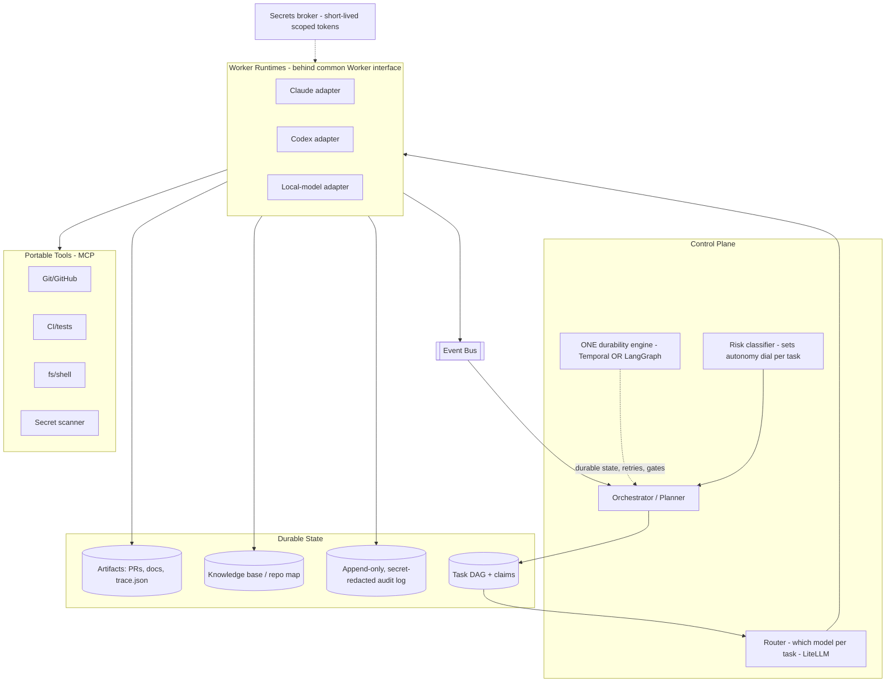

- **Control plane** — decides *what* and *which model* (router = vendor-agnosticism). Includes a **risk classifier** that sets the autonomy dial per task.
- **One durability engine** (§4.5) — persists phase state; **resume, don't restart**.
- **Task DAG + atomic claims** (`SELECT … FOR UPDATE SKIP LOCKED`) with **claim-lease TTL + reclamation** (a worker that dies holding a claim must have it reclaimed).
- **Knowledge base** — repo map, ADRs, conventions, retrieval over them. Plain retrieval, **not** a "learning" claim (see §13 research-spike note).
- **Artifact store** — PRs, `trace.json` (requirement→file→test), reports.
- **Event bus** — `task_claimed`, `branch_pushed`, `tests_failed`, `merge_conflict`, `human_gate_pending`, `post_merge_failed`.
- **Governance** — policy engine, **append-only hash-chained audit log with secret redaction**, full tracing.
- **Secrets broker** — short-lived scoped tokens per worktree; **secret-scan every diff and log line before persistence**.
- **Worker runtimes behind a common interface** (§4.4).
- **Portable tools (MCP)**.

---

## 6. The role model — an eng team mapped to agents

| Role | Responsibility | Gate? | Model tier |
|---|---|---|---|
| **Intake / PM** | Fuzzy request → spec + acceptance criteria; clarify | **spec** | Strong |
| **Architect / Planner** | Decompose → task DAG; ADRs; identify non-parallelizable work | **design** | Strong |
| **Implementer** | One scoped task, single-threaded, own worktree/branch | — | Mid/strong |
| **Tester** | Tests **from the contract, without seeing the implementation** | — | Mid |
| **Reviewer / Critic** | Adversarial review **against the contract**; try to *refute* | — | Strong |
| **Docs writer** | Docs, changelog, PR description | — | Cheap |
| **Integrator / Release** | Merge queue, conflict ladder, CI gate, PR | **pre-release + final-merge** | Mid + tools |
| **Coordinator** | Assign, track, own escalation & safe-state | — | Strong |

**Maker never grades the checker:** Implementer ≠ Reviewer ≠ Tester — distinct agents, no shared history. Router assigns cheap models to mechanical roles, strong models to planning/critique.

---

## 7. Architecture styles

The core. Every viable style, each with **how it works / diagram / pros / cons / when-to-use / cost-complexity / failure-modes.**

### 7.1 Style A — Orchestrator–Worker (fan-out / fan-in)
**How:** one orchestrator decomposes, fans out to parallel workers, verifies, integrates. The production workhorse. (Hub-and-spoke is the same thing — spokes = workers.)
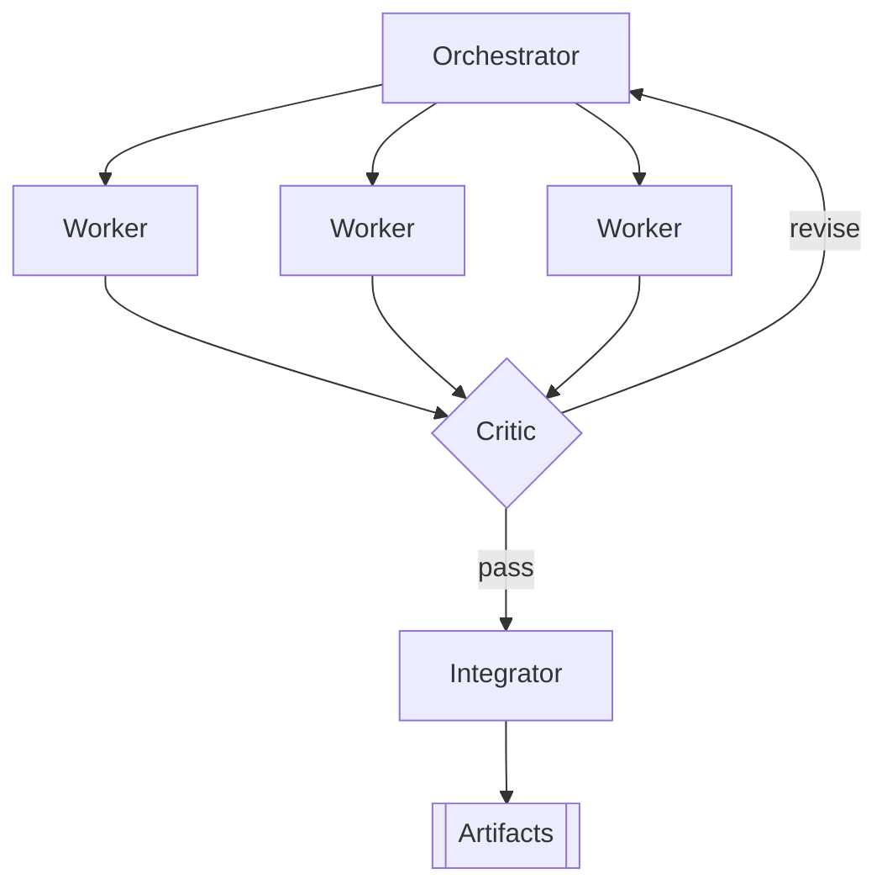
- **Pros:** simple, debuggable, naturally parallel, bounded cost, clear verification point; maps onto SDK subagents / SDK handoffs.
- **Cons:** orchestrator is a bottleneck + single point of failure; assumes clean up-front decomposition.
- **When:** most separable requests. **Best default; keep two-tier.**
- **Cost/complexity:** low–medium.
- **Failure modes:** bad decomposition cascades; vague briefs → duplicate/conflicting work; orchestrator context bloat.

### 7.2 Style B — Hierarchical (manager → leads → workers)
**How:** recursion of A; manager splits into sub-projects owned by leads. **Must be built at the orchestration layer** (subagents don't recurse — §4.1).
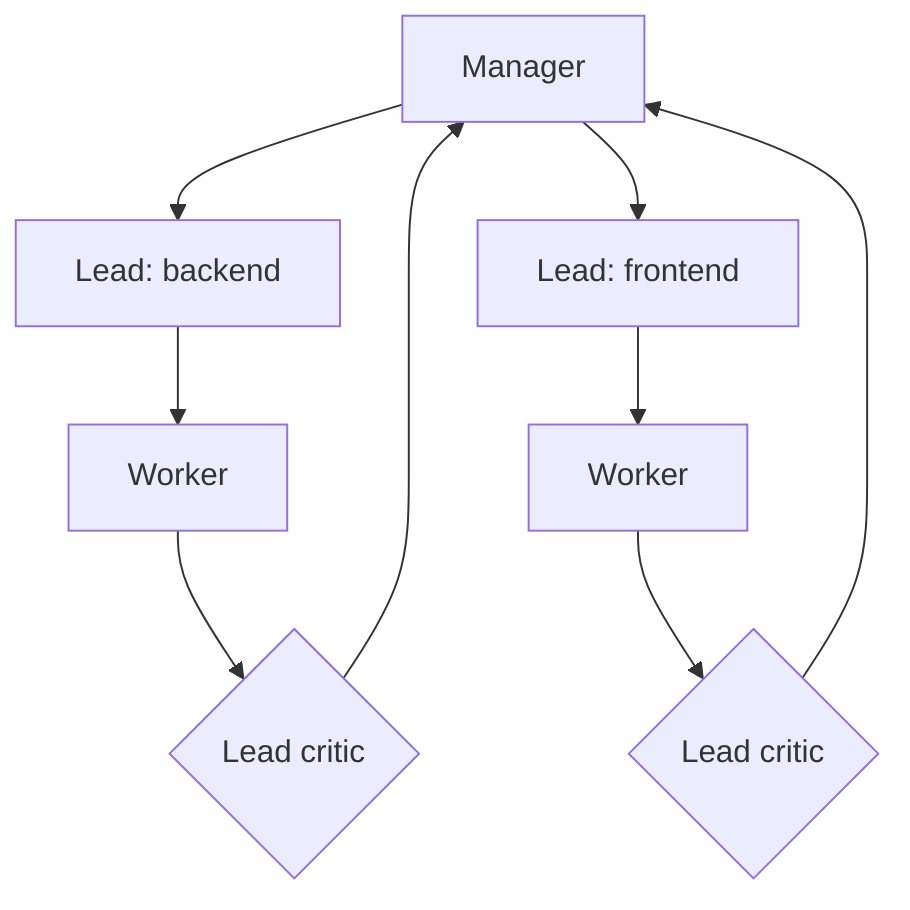
- **Pros:** scales to genuinely separable subsystems; context stays local per branch.
- **Cons:** coordination + latency tax per tier; **error compounding** down the chain; higher token cost.
- **When:** large multi-subsystem features, each with its own integration boundary. Overkill otherwise.
- **Cost/complexity:** medium–high.
- **Failure modes:** telephone-game drift; lead replan loops; cost blowups if depth unbounded.

### 7.3 Style C — Blackboard / shared-memory
**How:** agents read/write a shared workspace; a controller picks which contribution to apply.
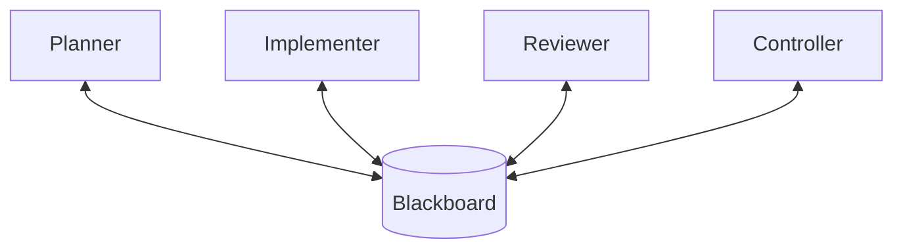
- **Pros:** emergent, loosely coupled, resilient to partial failure; natural fit for a knowledge base.
- **Cons:** hard to predict/control; thrashing/livelock; poor observability.
- **When:** exploratory work / debugging. **Use for *facts*, never as the who-edits-what coordinator** (implicit coordination over shared code drives the ~20% conflict rate).
- **Cost/complexity:** medium.
- **Failure modes:** board contention; overwrites; non-convergence without a strong controller.

### 7.4 Style D — Market / bidding (contract-net)
**How:** tasks auctioned; agents bid (confidence/cost/ETA); best bid wins — natural cost/capability routing (Claude vs Codex vs local bid per task).
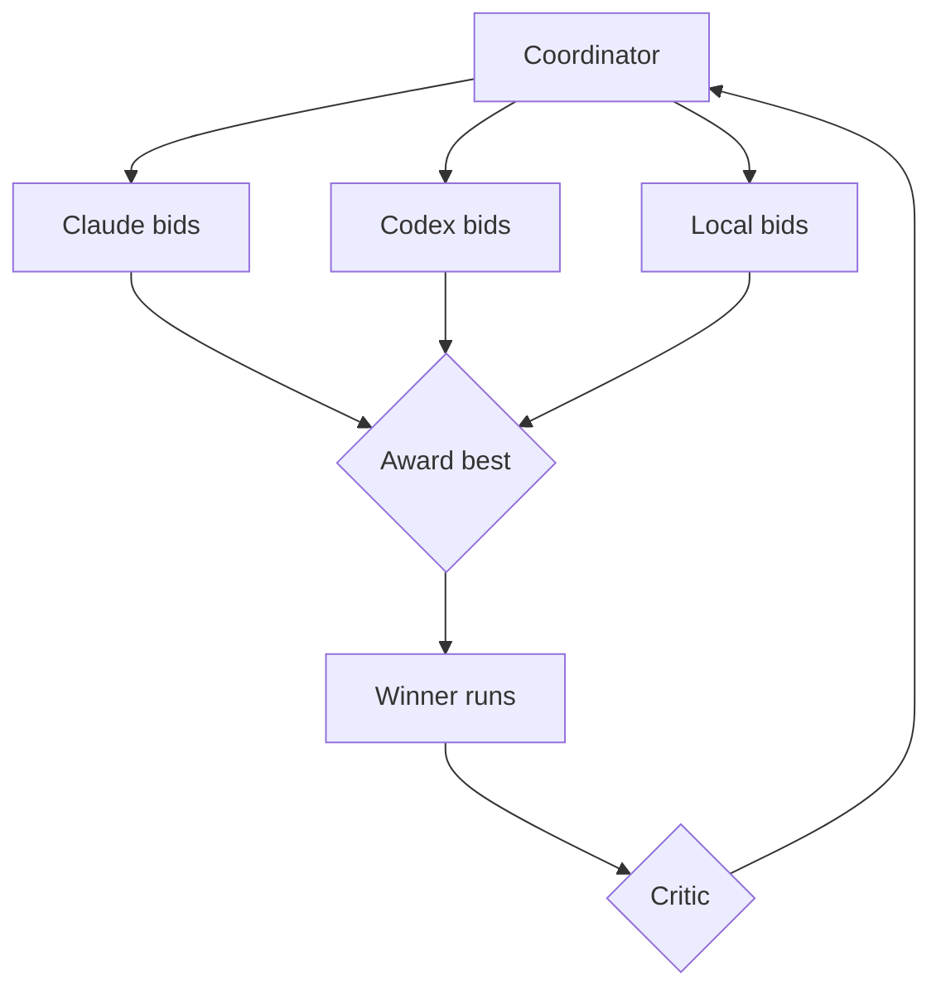
- **Pros:** self-optimizing cost/capability routing; decentralized load balancing; vendor-agnosticism falls out.
- **Cons:** auction latency/token overhead; agents misjudge confidence; needs trustworthy scoring.
- **When:** heterogeneous fleets, cost-first. **Scaling escape hatch, not V1.**
- **Cost/complexity:** medium–high.
- **Failure modes:** overconfident bids win bad work; overhead dominates small tasks; gaming.

### 7.5 Style E — Peer-to-peer / swarm (handoff)
**How:** no central boss; agents hand off directly (Agents-SDK handoffs, AutoGen chat).
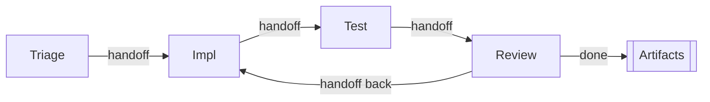
- **Pros:** no central bottleneck; flexible/conversational; low ceremony.
- **Cons:** hard to guarantee termination; diffuse state; loops; hardest to audit/bound cost.
- **When:** small open-ended teams / prototyping. **Premature for autonomous SWE — don't depend on real-time agent coordination.**
- **Cost/complexity:** low to build, high to control.
- **Failure modes:** infinite handoff loops; no owner of "done"; cost runaways.

### 7.6 Style F — Event-driven / choreography
**How:** no central orchestrator dictating steps; agents **react to events** on the bus and emit new events (choreography vs orchestration). The event bus (a building block) *becomes* the control model.
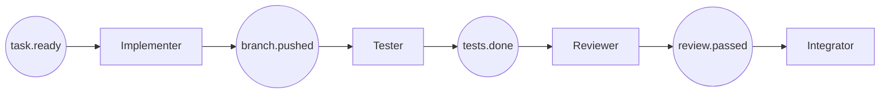
- **Pros:** highly decoupled, scalable, resilient; easy to add new reactive agents; natural async + audit trail.
- **Cons:** emergent global behavior is hard to reason about ("where is this job?"); no single place that knows the whole plan; debugging distributed causality is hard.
- **When:** large fleets, many event types, high concurrency; pairs well with A (orchestrated decomposition, choreographed execution).
- **Cost/complexity:** medium–high (needs a real bus + idempotent handlers).
- **Failure modes:** event storms / cycles; lost or duplicated events without exactly-once semantics; hidden coupling via event contracts.

### 7.7 Style G — Supervisor trees (the failure-recovery topology)
**How:** borrowed from Erlang/OTP — agents run under **supervisors** that own *restart strategies* (restart-one, restart-all-siblings, escalate-up) when a child crashes/hangs.
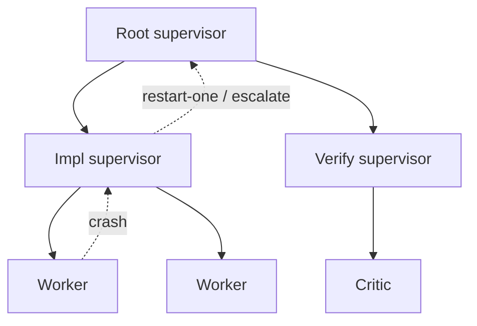
- **Pros:** principled crash recovery; bounds blast radius of a stuck/looping agent; complements any style above.
- **Cons:** not a work-decomposition model on its own (it's a *reliability* overlay); restart semantics for stateful agents are subtle.
- **When:** **always, as an overlay** for unattended (L3+) operation. This is *how* you make §5's claim-lease/reclamation concrete.
- **Cost/complexity:** medium.
- **Failure modes:** restart loops (a task that always crashes); losing in-flight work on restart if not checkpointed.

### 7.8 Style H — Ensemble / debate (the verification topology)
**How:** multiple agents independently solve or judge the *same* task, then reconcile by vote or structured **debate** (proposer vs critic argue; a judge decides).
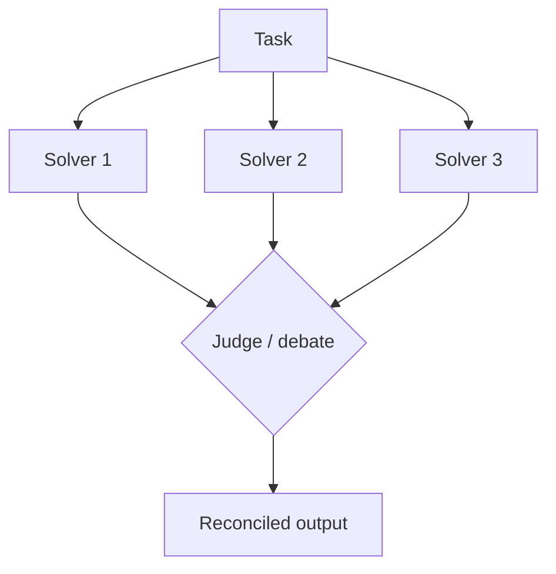
- **Pros:** raises quality/robustness on hard, ambiguous, or high-stakes tasks; debate surfaces disagreement a single pass hides.
- **Cons:** N× cost; **correlated errors** (same model family) cap the gain — see §9; slower.
- **When:** the *verification* layer for critical changes, and for design decisions (2–3 candidate architectures judged). **Not** for routine implementation.
- **Cost/complexity:** high (N× strong-model calls).
- **Failure modes:** false confidence from correlated agreement; judge inherits the same blind spots; cost explosion.

### 7.9 Styles considered and rejected (for completeness)
- **Actor model** (fine-grained message-passing actors): a good *implementation substrate* for any style above, but too low-level to be *the* team design — you'd rebuild orchestration on top. Use it under the hood if your runtime is actor-based; don't make it the architecture.
- **Human-as-agent** (a human is a node in the DAG, not just a gate): valuable and *already present* as the escalation/gate mechanism (§11); we model the human as a special worker the coordinator can "assign" a task to, rather than a distinct topology.
- **Pure hub-and-spoke:** identical to Style A (§7.1) — named here only so it's not thought omitted.

### 7.10 The cross-cutting axis — fixed pipeline vs dynamic planning
**How:** independent of topology, how rigid is the workflow? The right answer is a **fixed *lifecycle* wrapping dynamic *plans*.**
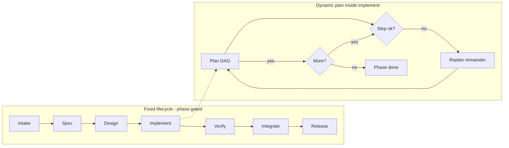
- **Pros (dynamic):** adapts to discoveries; **(fixed):** deterministic, cheap, auditable, easy to gate.
- **Cons (dynamic):** costlier, harder to bound; **(fixed):** brittle when reality deviates.
- **When:** fixed for routine changes; dynamic for novel ones; **the hybrid (deterministic phase gates + dynamic in-phase plan) is the recommendation.**
- **Cost/complexity:** hybrid = medium.
- **Failure modes:** dynamic → planner over-decomposes / replan thrash; fixed → silent brittleness when the world doesn't match the script.

### 7.11 At a glance
| Style | Control | Parallelism | Flexibility | Cost | Debuggability | Best for |
|---|---|---|---|---|---|---|
| A Orchestrator–Worker | Central | High | Med | Low | High | **Default** |
| B Hierarchical | Layered | High | Med | High | Med | Multi-subsystem |
| C Blackboard | Shared | Med | High | Med | Low | Exploration (facts) |
| D Market/bidding | Auction | High | High | Med-High | Med | Cost routing at scale |
| E Peer-to-peer | None | Med | High | Variable | Low | Small open-ended |
| F Event-driven | Choreographed | High | High | Med-High | Med | Large async fleets |
| G Supervisor trees | Hierarchical (recovery) | — | — | Med | Med | **Reliability overlay** |
| H Ensemble/debate | Parallel judge | — | — | High | Med | **Verification overlay** |

**Composition, not either/or:** the recommended design is **A (default) + G (reliability overlay) + H (verification overlay) + F (execution choreography at scale) + B (only for big multi-subsystem jobs)**.

---

## 8. Dynamic workflow generation
- **Plan-and-Execute at the top (with replanning)** — planner emits the DAG, executors run tasks; assess failures against the whole plan. Your top-level pattern.
- **ReAct inside each worker — budgeted** — reason→act→observe for one task, with a **step/cost cap + loop-breaker** (its failure mode is looping on a failed action).
- **Reflection must be cross-agent** — self-critique by the same model repeats its own blind spots; route critique to a *different* agent/model.
- **Tree-of-Thoughts** — only for branchy *design* decisions (2–3 candidate architectures).
- **Decompose → DAG → queue** — each task carries an acceptance criterion, a file scope, `depends-on` edges, and a **parallelizable? flag** (§9 non-parallelizable class). **Parallelism ≤ the DAG's independent frontier.** Atomic claims via `SKIP LOCKED` + lease TTL.
- **Replan honestly:** static replan (re-run planner on the remainder) is shippable now; **online mid-execution replanning is still immature — treat it as a research spike, not a dated deliverable** (§13).

---

## 9. Safe parallelism — many agents, one repo (textual *and* semantic)

Git worktrees are the primitive; but v2 over-claimed that partitioning solves conflicts. **It solves *textual* conflicts only.**

- **Branch-per-task + git worktrees** — `git worktree add ../wt-task-123 -b task/123` → filesystem isolation, no silent overwrites/lock contention.
- **Task-granular scoping** — planner pre-scopes non-overlapping file sets where possible; overlaps become dependency edges, not parallel tasks.
- **The non-parallelizable class (serialize, single-writer):** schema/migrations (ordering), shared interfaces/type signatures, dependency/lockfile bumps, generated code. These **rebase clean but break semantically** across non-overlapping files, and CI catches them **only if a test covers the interaction.** The planner must **flag these and run them single-writer**, never fan them out.
- **Serialized FIFO merge queue** — workers never merge to main; an **integrator** rebases + runs full CI per branch, one at a time.
- **Re-review after rebase** — rebasing changes the code the critic approved; **the critic must re-run post-rebase** (budget this cost/latency).
- **Conflict ladder:** auto-rebase clean → auto-resolve mechanical (imports/changelog) → bounce to originating implementer with context → escalate to human.
- **Honest residual risk:** the merge queue guarantees **textual + test-covered** correctness only. Semantic cross-task breakage in untested interactions is an **accepted residual** caught by the pre-release human gate (L1/L2) or post-merge auto-revert (L3).
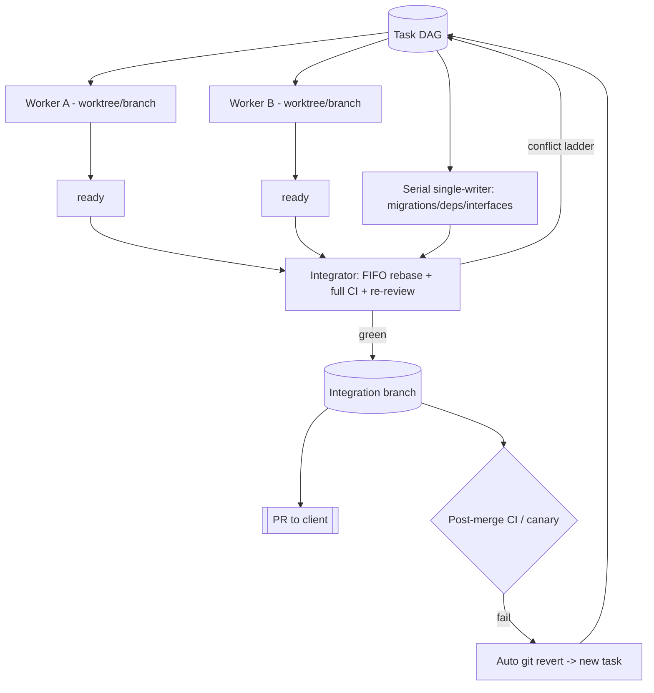

---

## 10. Security threat model (the missing piece for *any* autonomy)

A fully-autonomous fleet **ingests attacker-controllable text** (a malicious GitHub issue, a poisoned dependency README, a crafted code comment) and then **runs Bash**. Prompt injection is the #1 real-world risk and must be designed for, not assumed away.

- **Treat all repo/issue/PR/dependency content as untrusted input.** It can contain instructions aimed at your agents.
- **Separate "read untrusted input" from "high-privilege action."** The agent that reads an issue should not be the one holding secrets or merge rights.
- **Kernel-level sandbox + network egress denylist** for workers (Codex's sandbox model is a good reference; for Claude workers, run in an isolated container). No arbitrary outbound network from a worker that just read untrusted text.
- **PreToolUse hooks as the enforcement point** — deny edits to secrets/CI config, deny exfil-shaped commands (`curl`/`wget` to non-allowlisted hosts, base64-pipe-to-network), deny writes outside the task's file scope.
- **No secret-bearing env in worker context** — secrets come from the broker as short-lived scoped tokens; **scan every diff and every log line for secrets before persistence**; redact in the audit log.
- **Data/IP governance** — autonomous agents ship private source to third-party APIs. Classify repos: which may use hosted models vs must stay on **local/self-hosted** models; enforce routing by classification at the LiteLLM proxy.
- **Supply-chain caution** — an agent that adds a dependency is a supply-chain actor; gate dependency additions and run them through the non-parallelizable single-writer path + security scan.

---

## 11. Client interaction & the autonomy dial in practice
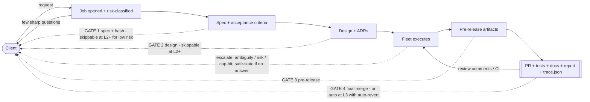
- **Four gates at L1; fewer as the dial opens** (§3). Each gate is **risk-tier-configurable**.
- **Clarify before building** — few, sharp questions (as at the start of this very task).
- **Escalation, not guessing** — on ambiguity/risk/cap-hit, pause and route a *specific* question; **safe-state (park, notify, free claim) if unanswered within SLA.**
- **Deliver artifacts, not process** — a PR with the `trace.json` mapping + a plain-language report.
- **Feedback → replan** — gate rejection resets that phase; PR comments / CI failures / post-merge reverts feed back as new tasks.

---

## 12. Economics & the GO/NO-GO decision

The honest cost question v2 ducked. A single non-trivial fleet job is:

`planner(strong) + N·implementer + N·tester + ≥3·critic(strong, voting) + integrator + docs`, each looping up to ~3×, plus re-review after rebase and possible replans.

- **Order-of-magnitude:** not 15× — plausibly **30–100× a single-agent call**, concentrated in the most expensive strong-model adversarial votes.
- **Worked envelope (illustrative — calibrate on your repo):** if one strong-model agentic pass ≈ $0.50–$3, a fleet job with ~3 workers + 3-critic voting + integrator + retries lands roughly **$15–$150 per non-trivial job**. Measure yours; don't trust this blindly.
- **Break-even vs "one engineer + one interactive agent":** the fleet wins only when **(a)** the work genuinely parallelizes (independent frontier ≥ ~3), **(b)** the spec is clear enough that the pre-code gates are cheap, and **(c)** the expected value of the change exceeds fleet cost *plus* the human gate-review time you still pay.

> **GO/NO-GO rule of thumb:** run the fleet when expected job value ≫ (fleet token cost + human gate-minutes × loaded rate), the task is parallelizable, and the spec is unambiguous. Otherwise drive one agent interactively. **Below that bar, the fleet is more expensive assisted coding, not a win.** Enforce with per-job **and** global (daily/monthly) budget ceilings at the proxy, hard-stop + alert on breach.

---

## 13. Iterations: simple → ambitious (with honest effort)

Effort estimates are widened from v2 (which was optimistic) and gate the two immature components behind research spikes.

### V0 — Single worker + adversarial checker (~days)
Headless worker (Claude `-p` or `codex exec`) → one branch → tests → PR, **+ independent Critic + independent Tester** (maker≠checker) + CI gate + 3-iteration cap. Two gates (spec, final-merge). No cross-task parallelism. **Highest ROI-to-complexity point; ship this first, on your throwaway repo, at dial L3 to prove unattended safety.**

### V1 — Orchestrated fleet + merge queue (**~3–6 weeks**, not 1–2)
Style A two-tier + **worker interface/adapter** (§4.4) + task queue w/ atomic claims+lease + independent critic/tester per task + **FIFO merge queue + conflict ladder + re-review** + integrator + event bus + `trace.json` + tracing/audit + **supervisor-tree overlay (G)** + **the held-out eval harness (its own workstream)**. Single vendor to start. *The merge queue + eval harness alone are multi-week.*

### V2 — Vendor-agnostic + durable + risk-tiered autonomy (**~2–3 months**)
Add **LiteLLM routing** + **MCP tool suite** + **one durability engine** (Temporal, §4.5) + **risk classifier + autonomy dial** + **security sandbox/threat-model hardening (§10)** + **auto-revert** + **plain-retrieval knowledge base** (repo map/ADRs — *retrieval, not "learning"*) + static replanning.

### Research spikes (off the dated critical path, each with a kill criterion)
- **Online mid-execution replanning** (§8) — immature; spike it, don't schedule it.
- **A "learning" knowledge base** that improves from experience — unsolved; V2 ships plain retrieval instead.
- **Opening the dial to L4** — gated on your eval proving critic catch-rate.

### V3 — Living fleet (ongoing)
Cost-aware/bidding routing (D), event-driven choreography at scale (F), scheduled/triggered runs, PR-watching, dashboards, hierarchical (B) for large programs — **each added only when metrics justify it.**

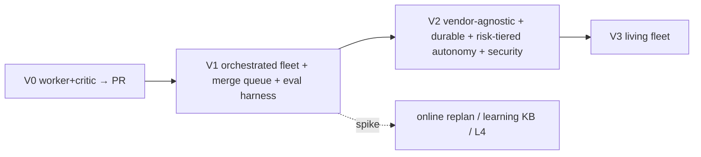

---

## 14. Final recommendation (for you, Doctor Biz)

**Build a deterministic phase-gated control plane orchestrating a small two-tier Orchestrator–Worker fleet (A), overlaid with supervisor-tree reliability (G) and ensemble/debate verification (H), executed via event choreography (F) as you scale, with git-worktree isolation + a serialized merge queue (semantic-aware), one durability engine, a common worker interface for vendor-agnosticism, and a configurable autonomy dial — proven first at V0 on your throwaway repo.**

Recommended stack (all MIT/Apache-2.0 core):

| Layer | Choice | Note |
|---|---|---|
| Durability | **Temporal** (V2+); LangGraph alone is fine for V1 | **Pick one** (§4.5) — do not stack both |
| Per-task orchestration | Your control-plane code (LangGraph optional) | Hierarchy built here, not via subagent recursion |
| Model routing | **LiteLLM proxy** | Model-swap = config (real); this *is* vendor-agnosticism at the model layer |
| Worker runtimes | **Claude Code + Codex** behind a **common Worker adapter** | Runtime-swap = an adapter, **not** config |
| Tools | **MCP servers** | Write once, all runtimes |
| Verification | Auto gates → independent tester → **diverse-lens critic (H)**, cap ~3 | Honest false-neg rate; gates catch the rest |
| Reliability | **Supervisor trees (G)** + claim-lease reclamation | For L3+ unattended |
| Security | §10 threat model | Prerequisite for *any* unattended mode |

**Why not the others as primary:** P2P (E) can't bound cost/termination unattended; blackboard (C) as *control* drives conflicts (use it for facts); hierarchical (B) from day one pays the coordination tax before V1 is proven; bidding (D) overhead isn't worth it until heterogeneous+cost-sensitive.

**Decision matrix — style per situation**
| Job | Style |
|---|---|
| Normal feature/bugfix, separable | **A** (+G,+H overlays) |
| Large, multi-subsystem | **B** |
| Exploratory / debugging | **C** for facts |
| Cost-sensitive, heterogeneous models | **D** routing |
| Tiny, open-ended prototype | **E** |
| Large async, many event types | **F** |
| Crash/hang resilience (always, L3+) | **G** overlay |
| Critical change / design choice | **H** overlay |
| Routine change | fixed pipeline |
| Novel change | dynamic + static replan |

**Tailored to your context (from CLAUDE.md):** you work in **Scala/SBT** (you compile SBT yourself — the fleet must *not* run `sbt compile`; wire that as a human/your-side step and have the fleet wait for your compile feedback) and **Python with `uv`**. So: for Python tasks, workers get the full CI gate (pytest via `uv`, ruff, mypy); for Scala tasks, the fleet stops at the diff + tests-it-can-run and hands compile/verify to you — model this as a first-class "external verifier" node. Your TDD-first, real-data-no-mocks house rules map directly onto the "tester writes contract tests first" and "no mock mode" gates.

**Phased roadmap:** V0 (days) → prove unattended on the throwaway repo at L3 → V1 (~3–6 wks) single-vendor orchestrated fleet + eval harness → V2 (~2–3 mo) vendor-agnostic + durable + risk-tiered + secured → V3 ongoing. **The critique-improve loop goes in at V0 and never leaves.**

---

## 15. Risks & guardrails
| Risk | Mitigation |
|---|---|
| Plausible-but-wrong work | Independent adversarial critic (maker≠checker) vs contract + tests as hard gate; **honest about high false-neg on subtle bugs → human gate backstop** |
| Correlated critic errors | Diverse lenses + different model families where possible; **measure catch-rate on your eval**; don't over-trust the vote |
| Prompt injection / untrusted input | §10 threat model — sandbox, egress denylist, PreToolUse denies, read/act separation |
| Cost runaway | Iteration cap ~3 + per-agent `max_budget_usd` + **per-job & global ceilings** at the proxy, hard-stop+alert |
| Textual conflicts | Worktree isolation + FIFO merge queue |
| **Semantic** cross-task breakage | Non-parallelizable class serialized single-writer; re-review post-rebase; post-merge auto-revert |
| Crash/hang/stuck claim | Supervisor trees + claim-lease TTL + reclamation + worktree GC + integrator idempotency |
| Escalation unanswered | Safe-state: park branch, snapshot, notify, free claim; never auto-merge past a gate |
| Bad merge reaches main | Post-merge CI/canary → auto `git revert` → new task |
| Vendor lock-in | LiteLLM + MCP + worker interface; no provider hardcoded in business logic |
| Immature components on critical path | Online replan + "learning" KB = research spikes with kill criteria, not dated deliverables |
| Model version drift | Pin model versions; re-run held-out eval before adopting a new snapshot |
| Data/IP leakage | Classify repos; route sensitive to local/self-hosted models |

---

## 16. Testing, observing & operating the fleet itself

The fleet is software; per your TDD house rules it needs unit/integration/e2e tests of its **own** machinery:

- **Unit:** control-plane logic — DAG scheduling, `SKIP LOCKED` claim races, lease reclamation, merge-queue FIFO invariants, conflict-ladder branches, budget hard-stops.
- **Integration:** the pipeline with a **stub worker** (deterministic fake) — spec→plan→execute→verify→integrate, plus escalation and safe-state paths.
- **E2E / eval:** a seeded suite of tasks with known-good PRs to regression-test the whole pipeline **and the critic's catch-rate** (precision/recall on planted bugs). This is the held-out eval; it is its own workstream (V1).
- **Observability from V1 (not V3):** OpenTelemetry spans per phase/agent/tool-call, correlated request→task→branch→PR; a live job-state view ("where is job X, which gate, what's blocked").
- **Fleet KPIs (tracked, regression-gated):** autonomous-success rate, human-intervention rate, **cost-per-PR**, cycle time, **escaped-defect rate**, **critic precision/recall**. These numbers are what let you *responsibly open the autonomy dial*.
- **Repo onboarding (precondition to V2's KB):** index repo → build repo map → detect conventions + test commands → establish a **green baseline** (run existing tests) → ingest ADRs. A repo the fleet hasn't onboarded runs at a lower dial.

---

## 17. Appendix — concrete schemas & build order (so you can start)

**Task record**
```json
{
  "id": "task-123", "job_id": "job-7", "title": "add OAuth callback handler",
  "acceptance_criteria": ["AC-1: /oauth/callback exchanges code for token", "AC-2: invalid state → 400"],
  "file_scope": ["src/auth/oauth.py", "tests/auth/test_oauth.py"],
  "depends_on": ["task-120"], "parallelizable": true,
  "risk_tier": "medium", "assigned_model": "claude", "branch": "task/123",
  "status": "in_progress", "attempts": 1, "max_attempts": 3,
  "claim": {"owner": "worker-2", "lease_expires": "<ts>"}
}
```
**`trace.json` (Definition of Done)**
```json
{"job_id":"job-7","spec_hash":"sha256:…",
 "criteria":[{"id":"AC-1","files":["src/auth/oauth.py"],"tests":["tests/auth/test_oauth.py::test_callback_exchange"],"status":"pass"}],
 "unscoped_changes":[], "security_scan":"clean"}
```
**Event contracts (bus):** `task.ready`, `task.claimed`, `branch.pushed`, `tests.done{pass|fail}`, `review.done{pass|fail}`, `merge.requested`, `merge.done`, `merge.conflict`, `post_merge.failed`, `human_gate.pending`, `escalation.raised`, `safe_state.entered`. Each carries `job_id`, `task_id`, `ts`, idempotency key.
**Merge queue choice:** start with **GitHub's native merge queue** if you're on GitHub (less to build); move to a **custom integrator agent** only when you need the auto-resolve conflict ladder.
**V0 build order:** (1) MCP git/GitHub tool → (2) worker runs task on a branch → (3) CI gate (tests must be pristine) → (4) independent critic + tester agents → (5) iteration cap + PR creation → (6) wrap the whole thing at dial L1, then test L3 on the throwaway repo.

---

## 18. Sources

*Verified primary/official:* [Anthropic Agent SDK](https://code.claude.com/docs/en/agent-sdk/overview.md), [Subagents](https://code.claude.com/docs/en/agent-sdk/subagents.md), [Permissions](https://code.claude.com/docs/en/agent-sdk/permissions.md), [Hooks](https://code.claude.com/docs/en/agent-sdk/hooks.md), [Headless](https://code.claude.com/docs/en/headless.md), [Managed Agents](https://platform.claude.com/docs/en/managed-agents/overview.md), [Anthropic — multi-agent research system](https://www.anthropic.com/engineering/multi-agent-research-system) (source of the ~15×-vs-chat and "coding is less parallelizable" claims), [OpenAI Codex](https://openai.com/index/introducing-codex/), [OpenAI Agents SDK](https://openai.github.io/openai-agents-python/) + [LiteLLM integration](https://github.com/openai/openai-agents-python/blob/main/docs/models/litellm.md), [OpenAI — scaling code verification](https://alignment.openai.com/scaling-code-verification/), [LiteLLM](https://docs.litellm.ai/), [LangGraph](https://langchain-ai.github.io/langgraph/), [Temporal for AI](https://temporal.io/solutions/ai), [Linux Foundation A2A](https://www.linuxfoundation.org/press/linux-foundation-launches-the-agent2agent-protocol-project-to-enable-secure-intelligent-communication-between-ai-agents), [SWE-bench](https://www.swebench.com/), [SWE-agent](https://github.com/SWE-agent/SWE-agent), [OpenHands](https://github.com/All-Hands-AI/OpenHands), [Aider](https://aider.chat/), [Model Context Protocol](https://modelcontextprotocol.io/).

*Secondary / practitioner (treat as directional):* Augment Code guides on adversarial code review and git-worktree parallel agents; Confluent on event-driven agentic systems; IBM on the agent control plane; practitioner write-ups comparing ReAct / Plan-and-Execute / Reflexion.

> **Evidentiary honesty (applied uniformly):** the "~20% parallel-agent conflict rate," the "~20% of SWE-bench solves are semantically wrong," and cautionary runaway-cost anecdotes come from **single preprints or practitioner posts** and are treated as **directional, not settled** — none is load-bearing on its own. v2's specific fabricated-looking arXiv IDs and the misattributed "$47k/11-day" anecdote have been **removed**. Inflated 85–95% SWE-bench figures from AI-generated SEO content are excluded. **Verify any figure against a primary source before external publication, and calibrate all cost/benchmark numbers on your own repos.**

---

*v3 survived one full adversarial critique round (accuracy, completeness, feasibility). Next: round 2 to confirm the loop is drying up, then the visual architecture artifact.*
